# 一些论文笔记记录

## 常规命名实体识别

## 嵌套和不连续命名实体识别

### **Boundary Enhanced Neural Span Classification for Nested Named Entity Recognition**. **(AAAI2020)**

基于跨度的方法主要侧重于学习span表征，但缺乏明确的边界监督。为了解决上述两个问题，我们提出了一种边界增强的神经广度分类模型。除了对跨度进行分类之外，我们还建议加入一个额外的边界检测任务来预测那些作为实体边界的单词。这两项任务是在多任务学习框架下联合训练的，该框架通过额外的边界监督来增强跨度表征。

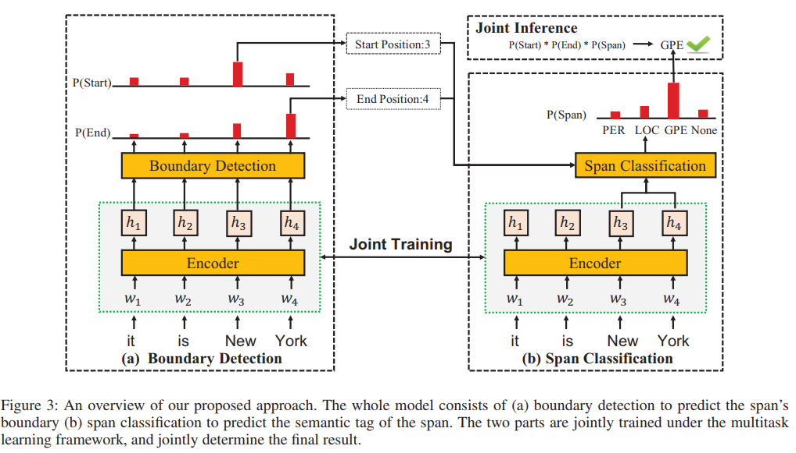

### **A Span-Based Model for Joint Overlapped and Discontinuous Named Entity Recognition. (ACL2021)**

大部分工作聚集在重叠NER上，基于超图的方法和基于转换的在NNER上却得了不错的效果，但是这些模型需要手工去定义一些图节点、边以及转换动作。而且这些模型是逐步建立的图或者生成转换，会产生误差传播问题。因此转向了基于span的方法。 在常规NER中（代表模型：seq2seq和Span-based），嵌入语义信息很有效果。目前有三种方案处理NNER(扩展标注模式、超图、基于转换的)。作者的整体：基于Span+GCN嵌入语义信息。整体采用基于span的方法，首先枚举出所有可能的span，然后利用一个多分类器去判定一个span是否是实体以及属于哪种实体类型。基于此，重叠实体可以被识别出。模型实施成对实体关系分类，去识别实体间的关系。作者为此定义三种实体间的关系：**Succession**:表明两个实体片段属于一个单独的命名实体；**Overlapping**: 表明两个实体片段有重叠的部分；**Other**:有其他的关系或没有关系。

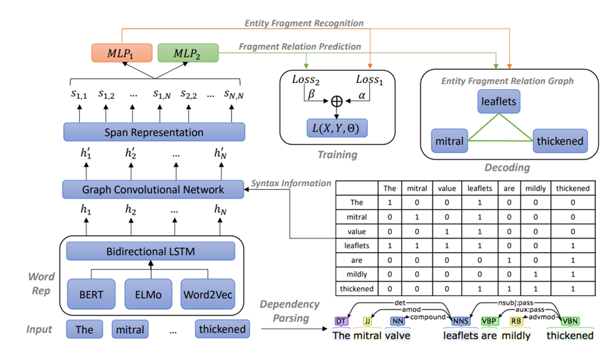

### **Bipartite Flat-Graph Network for Nested Named Entity Recognition. (ACL2021)**

作者在相关工作中提到了识别三种重叠实体和不连续实体的baseline方法。①分层模型，会导致误差传播、高层实体稀疏性等问题。②基于区域的模型，忽略显示的边界信息。③前两者结合，很少关注内部实体和外部实体的交互。

将内层实体与外部实体单独处理，但同时考虑之间的交互。具体来说：具体来讲，具有最大覆盖范围的最外层实体使用扁平实体识别模型来识别，所有的内层实体通过一个图模块来抽取，在这里图模块使用图卷积神经网络(**GCN**)在一个span的开始词元和结束词元之间消息传递。

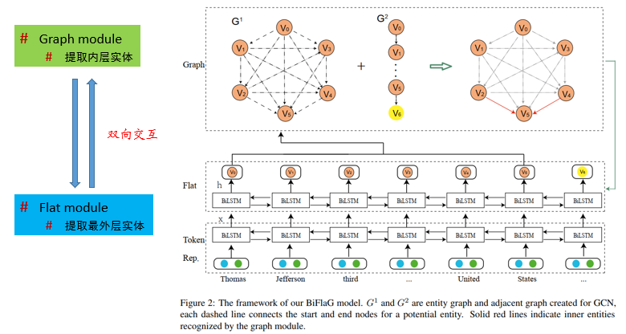

### **Locate and Label：A Two-stage Identifier for Nested Named Entity. (ACL2021)**

将span-based作为baseline方法，提出对其“计算复杂度高”的不足进行改进。尽管这些方法具有处理嵌套NER的固有能力，但它们存在计算成本高、忽略边界信息、未充分利用与实体部分匹配的跨度以及难以识别长实体等问题。为了解决这些问题，我们提出了一种两阶段实体标识符。首先，我们通过对种子跨度进行过滤和边界回归来生成跨度建议，以定位实体，然后用相应的类别标记边界调整后的跨度建议。该方法在训练过程中有效地利用了实体和部分匹配跨距的边界信息。通过边界回归，理论上可以覆盖任意长度的实体，提高了识别长实体的能力。此外，许多低质量的种子跨度在第一阶段被过滤掉，这降低了推理的时间复杂度。为了解决类别不平衡问题，这里还用到了focal loss.

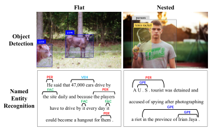

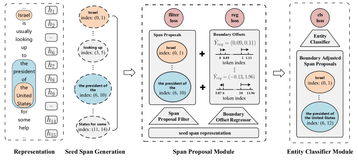

### **A Boundary-aware Neural Model for Nested Named Entity Recognition (EMNLP2019)**

大多数现有的命名实体识别（NER）工作只处理平面实体，而忽略嵌套实体。我们提出了一个嵌套NER的边界感知神经模型，该模型利用实体边界来预测实体类别标签。我们的模型可以通过使用序列标记模型检测边界来精确定位实体。基于检测到的边界，我们的模型利用边界相关区域来预测实体分类标签，这可以降低计算成本并缓解分层序列标签模型中的错误传播问题。我们引入多任务学习来捕获实体边界及其分类标签的依赖关系，这有助于提高识别实体的性能。

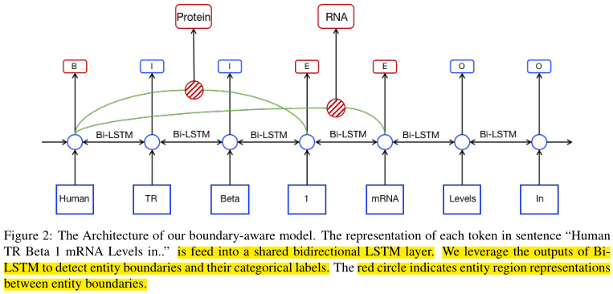

我们的模型建立在一个共享的双向LSTM层上。它使用LSTM层的输出来检测实体边界和预测分类标签。我们将实体边界提取为带有标签B和标签E的成对标记，“B”表示实体的开始，“E”表示实体的结束。我们将每个检测到的令牌与标签B匹配，并将其对应的令牌与标签E匹配，它们之间的区域被识别为候选实体。我们使用共享LSTM的相应区域输出来表示实体，并将它们分类为分类标签。边界检测模块和实体分类标签预测模块通过一个多任务损失函数同时进行训练，该函数可以捕获实体边界及其分类标签的潜在依赖关系。

### **A Supervised Multi-Head Self-Attention Network for Nested Named Entity(AAAI2021)**

对比Boundary-aware那篇。

研究人员对识别具有嵌套结构的重叠实体越来越感兴趣。然而，现有的大多数模型忽略了不同实体类型下单词之间的语义相关性。考虑到句子中的词在不同实体类型下扮演不同的角色，我们认为应该考虑每种实体类型的句子中成对词的相关强度。

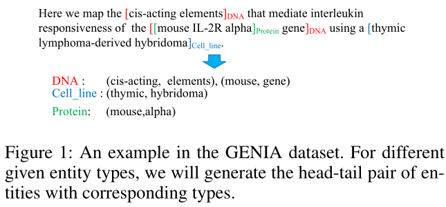

尽管边界感知模型取得了重大进展，但它们独立预测实体的边界，忽略了实体的头部和尾部之间的相关性。此外，对于跨度分类，它们仍然依赖于跨度表示，忽略了实体跨度和实体类型之间的相关性。我们假设，如果我们考虑一个实体跨度的头尾对作为一个类型空间中的一个点，则点之间没有重叠，如图1所示。此外，考虑到句子中的单词在不同类型下扮演不同的角色，我们认为在不同的实体类型下，句子中候选跨度的头尾对的相关强度是不同的。

在本文中，我们将命名实体识别视为词对的多类分类，并设计了一个简单的神经模型来处理这个问题。我们的模型采用监督的多头自我注意机制，每个头对应一种实体类型，为每种类型构建词级关联。我们的模型可以根据相应类型下其头部和尾部的相关强度灵活地预测跨度类型。此外，我们通过一个多任务学习框架融合实体边界检测和实体分类，该框架可以捕获这两个任务之间的依赖关系。

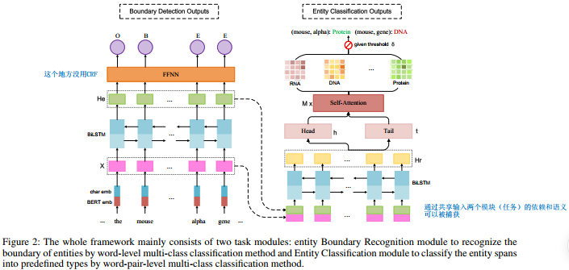

具体来说，我们使用两个单层线性全连接层将句子中的每个单词映射到头和尾表示空间中，该空间可以学习识别跨度的头/尾标记。为了了解句子中单词之间的相关性，我们利用了自注意机制。考虑到在不同的实体类型下，词对的相关强度通常是不同的，我们将每个类型映射到多个头的子空间中，并在每个类型空间中对句子进行自我注意操作。此外，我们还引入了一个多任务学习框架来捕获实体边界检测和实体分类之间的依赖关系，进一步提高了模型的性能。

之前的疑问（现在已经解决疑惑）：BD模块检测出的BIE标签和第二阶段有什么联系？

BD是边界检测模块，BD模块的输出是一系列BIE标签，将E标签和前面的B标签组成候选的span，响应的被B和E标记的token作为该span的head和tail。

### **HIT：Nested Named Entity Recognition via Head-Tail Pair and Token Interaction(ACL2020)**

命名实体识别是自然语言处理中的一项基本任务。为了识别具有嵌套结构的实体，最近在传统序列标记方法或有向超图结构的基础上发展了许多复杂的方法。尽管取得了成功，但这些方法往往无法在嵌套结构的表达能力和模型复杂性之间取得良好的平衡。

为了解决这个问题，我们提出了一个新的嵌套NER模型HIT。我们提出的HIT模型利用了与（嵌套的）命名实体相关的两个关键属性，包括（1）显式边界标记和（2）边界内标记之间的紧密内部连接。具体来说，我们设计了（1）基于多头自注意机制的头尾检测器和双仿射分类器来检测边界token，以及（2）基于传统序列标记方法的令牌token标记器来表征边界内的内部令牌连接。

下图描述了我们模型的总体架构。HIT包含三个主要组件，包括头尾检测器、token交互标记器和区域分类器。对于每个给定的句子$${x}=\left\{w_{1}, w_{2}, \ldots, w_{m}\right\}$$，其中m是句子的长度，HIT首先将句子x映射到token表示序列 。$$
\mathbf{x}=\left\{\mathbf{w}_{1}, \mathbf{w}_{2}, \ldots, \mathbf{w}_{m}\right\}
$$然后，表示序列**x**被馈送到头尾检测器，以预测每对token是否为实体的头尾。同时，token交互标记器用于根据上下文捕获相邻token之间的内部连接，这表明当前token之前或之后的token是否属于实体。最后，利用区域分类器将头尾检测器和token交互标记器相结合，完成实体识别。

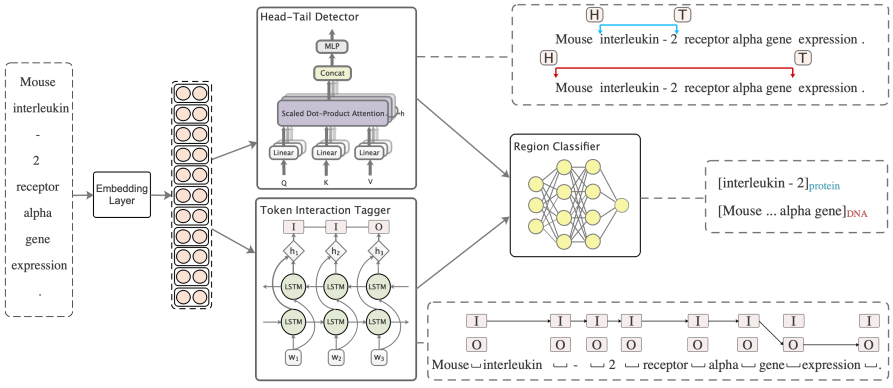

### **BERT-Biffine:Named Entity Recognition as Dependency Parsing.(ACL2020)**

* 用依赖解析的方式去进行命名实体识别

## 统一命名实体识别

### **W2NER**：**Unified Named Entity Recognition as Word-Word Relation Classification AAAI2022.**

最近，人们对unified NER产生了越来越大的兴趣，用一种模型同时解决上述三个工作。目前表现最好的方法主要包括基于跨度的模型和序列到序列的模型，不幸的是前者只关注边界识别，而后者由于seq2seq结构可能存在天生的缺陷：暴露偏差（exposure bias：https://kexue.fm/archives/7259， https://zhuanlan.zhihu.com/p/346897151）  在这项工作中，我们提出了一种新的替代方法，通过将统一的NER建模为word-word关系分类，即W2NER。该体系结构通过有效地建模实体词与下一个相邻词（NNW）和尾部词（THW-星）关系之间的相邻关系，解决了统一NER的核心瓶颈。基于W2NER方案，我们开发了一个神经框架，其中统一的NER被建模为二维单词对网格。然后，我们提出多粒度二维卷积来更好地细化网格表示。最后，使用一个协预测器对单词关系进行充分推理。我们对14个广泛使用的基准数据集（8个英文数据集和6个中文数据集）进行了广泛的实验，其中我们的模型击败了所有当前性能最好的基线，推动了统一NER的最先进性能。首先，广泛使用的预训练语言模型BERT和双向LSTM被用作编码器，从输入句子中产生语境化的单词表示。然后，使用卷积层构建和细化词对网格的表示，以便后续的词-词关系分类。之后，利用包含双仿射分类器和多层感知器的协同预测层联合推理所有词对之间的关系。

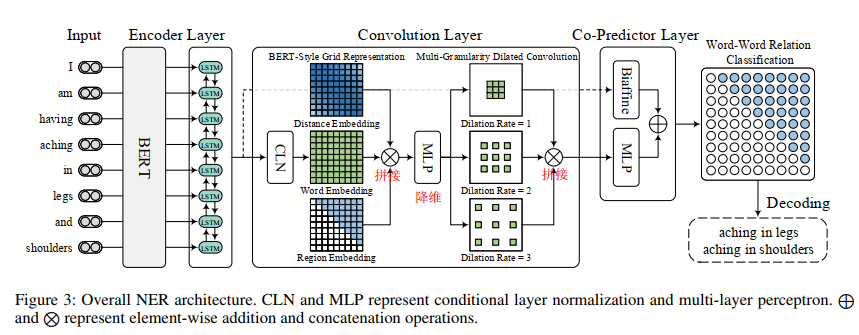

## 实体和关系联合抽取

### **TPLinker:Single-stage Joint Extraction of Entities and Relations Through Token Pair Linking. CLONG2020.**

TPLinker是实体关系抽取的新范式，巧妙设计了统一的联合抽取标注框架，可实现单阶段联合抽取、并解决暴漏偏差，同时依旧可以解决复杂的重叠关系抽取。实体关系抽取是NLP社区备受关注的子任务之一，热度很高，在2020年SOTA就更换了好几次。本文主要针对实体关系的「**联合抽取**」进行介绍；Pipeline方式不再赘述，可到知乎搜索JayJay的《nlp中的实体关系抽取方法总结》进行查阅。联合抽取主要分为2种范式：

 多任务学习：即实体和关系任务共享同一个编码器，但通常会依赖先后的抽取顺序：关系判别通常需要依赖实体抽取结果。这种方式会存在暴漏偏差，会导致误差积累。

结构化预测：即统一为全局优化问题进行联合解码，只需要一个阶段解码，解决暴漏偏差。

从上面的分析我们可以看出：结构化预测方式可以解决暴漏偏差问题；基于此，本文就介绍一篇来自COLING20的论文《TPLinker: Single-stage Joint Extraction of Entities and Relations Through Token Pair Linking》，其主要亮点为：

- TPLinker将抽取标注框架统一为**字符对链接**问题，即Token Pair Linking problem；
- TPLinker**既可以解决重叠关系问题、同时也可解决暴漏偏差问题**！
- TPLinker是**单阶段解码**，训练和推断阶段抽取三元组不存在差异。

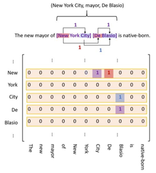

TPLinker其实就是通过链接(linking)3种类型的Span矩阵来实现的，为方便起见，论文作者将3种标注方式画到一个图里了，如上图所示（记关系类别总数为R个）：

**1.紫色标注**：EH to ET，表示实体的头尾关系，是1个$$
N * N
$$矩阵；如两个实体：New York City:M(New, City) =1; De Blasio:M(De, Blasio) =1。

**2.红色标注**：SH to OH，表示subject和object的头部token间的关系，是$$
\underline{R} \text { 个 } N * N
$$矩阵；如三元组(New York City, mayor,De Blasio):M(New, De)=1。

**3.蓝色标注**：ST to OT，表示subject和object的尾部token间的关系，是$$
\underline{R} \text { 个 } N * N
$$矩阵；如三元组(New York City, mayor,De Blasio):M(City, Blasio)=1。

因此，可以得到TPLinker共有$$\underline{2R+1}$$个矩阵。值得注意的是：为防止稀疏计算，下三角矩阵不参与计算；虽然实体标注不会存在于下三角矩阵种，但关系标注是会存在的。

为此，论文采取转换操作是：如果关系存在于下三角，则将其转置到上三角，并有“标记1”变为“标记2”。

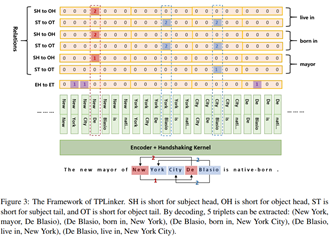

上图给出了一个完整的标注和编码示意图，标记有“0、1、2”三种。

编码部分实际上是将原始的Span矩阵会展开为一个$$
\frac{N *(N+1)}{2}
$$序列进行编码，也就是将token pair的每一个token编码拼接在一起。

TPLinker的解码过程为：

1.解码EH-to-ET可以得到句子中所有的实体，用实体头token idx作为key，实体作为value，存入字典D中；

2.对每种关系r，解码ST-to-OT得到token对存入集合E中，解码SH-to-OH得到token对并在D中关联其token idx的实体value；

3.对上一步中得到的SH-to-OH token对的所有实体value对，在集合E中依次查询是否其尾token对在E中，进而可以得到三元组信息。

结合上图的具体case,我们具体描述一下解码过程：

解码EH-to-ET中得到3个实体：{New York,New York City,De Blasio}; 字典D为：{New:(New York,New York City),De:(De Blasio)}

以关系“**mayor**”为例:

1.解码ST-to-OT得到集合E：{(City,Blasio)};解码SH-to-OH得到{(New,De)}，其在字典D中可关联的subject实体集合为{New York,New York City};object集合{De Blasio};

2.遍历上述subject集合和object集合，并在集合E中查询尾token，发现只有一个实体三元组{New York City,mayor,De Blasio}.

以关系“**born in**”为例:

1.解码ST-to-OT得到集合E：{(Blasio,York),(Blasio,City)};解码SH-to-OH得到{(De,New)}，其在字典D中可关联的subject实体集合为{De Blasio};object集合为{New York,New York City};

2.遍历上述subject集合和object集合，并在集合E中查询尾token，可得到2个实体三元组：{De Blasio,born in,New York}和{De Blasio,born in,New York City}.

由于关系live in与born in一样，所以我们最终可得到5个三元组：

(New York City, mayor, De Blasio), (De Blasio, born in, New York), (De Blasio, born in, New York City), (De Blasio, live in, New York), (De Blasio, live in, New York City)

## 其他

