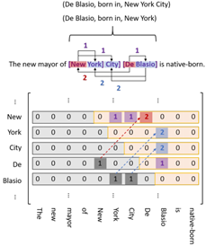

# 一些论文笔记记录

- [一些论文笔记记录](#一些论文笔记记录)
  - [常规命名实体识别](#常规命名实体识别)
    - [**Bidirectional LSTM-CRF Models for Sequence Tagging(ACL 2015)**](#bidirectional-lstm-crf-models-for-sequence-taggingacl-2015)
    - [**Lattice LSTM：Chinese NER Using Lattice LSTM. (ACL2018)**](#lattice-lstmchinese-ner-using-lattice-lstm-acl2018)
    - [**CGN:Leverage Lexical Knowledge for Chinese Named Entity Recognition via Collaborative Graph Network (EMNLP 2019)**](#cgnleverage-lexical-knowledge-for-chinese-named-entity-recognition-via-collaborative-graph-network-emnlp-2019)
    - [**Lexicon-Based Graph Neural Network for Chinese NER. (EMNLP2019)**](#lexicon-based-graph-neural-network-for-chinese-ner-emnlp2019)
    - [**Simplify the Usage of Lexicon in Chinese NER (ACL2020）**](#simplify-the-usage-of-lexicon-in-chinese-ner-acl2020)
  - [嵌套和不连续命名实体识别](#嵌套和不连续命名实体识别)
    - [**Boundary Enhanced Neural Span Classification for Nested Named Entity Recognition**. **(AAAI2020)**](#boundary-enhanced-neural-span-classification-for-nested-named-entity-recognition-aaai2020)
    - [**A Span-Based Model for Joint Overlapped and Discontinuous Named Entity Recognition. (ACL2021)**](#a-span-based-model-for-joint-overlapped-and-discontinuous-named-entity-recognition-acl2021)
    - [**Bipartite Flat-Graph Network for Nested Named Entity Recognition. (ACL2021)**](#bipartite-flat-graph-network-for-nested-named-entity-recognition-acl2021)
    - [**Locate and Label：A Two-stage Identifier for Nested Named Entity. (ACL2021)**](#locate-and-labela-two-stage-identifier-for-nested-named-entity-acl2021)
    - [**A Boundary-aware Neural Model for Nested Named Entity Recognition (EMNLP2019)**](#a-boundary-aware-neural-model-for-nested-named-entity-recognition-emnlp2019)
    - [**A Supervised Multi-Head Self-Attention Network for Nested Named Entity(AAAI2021)**](#a-supervised-multi-head-self-attention-network-for-nested-named-entityaaai2021)
    - [**HIT：Nested Named Entity Recognition via Head-Tail Pair and Token Interaction(ACL2020)**](#hitnested-named-entity-recognition-via-head-tail-pair-and-token-interactionacl2020)
    - [**BERT-Biffine:Named Entity Recognition as Dependency Parsing.(ACL2020)**](#bert-biffinenamed-entity-recognition-as-dependency-parsingacl2020)
  - [统一命名实体识别](#统一命名实体识别)
    - [**W2NER**：**Unified Named Entity Recognition as Word-Word Relation Classification AAAI2022.**](#w2nerunified-named-entity-recognition-as-word-word-relation-classification-aaai2022)
  - [实体和关系联合抽取&关系抽取](#实体和关系联合抽取关系抽取)
    - [**TPLinker:Single-stage Joint Extraction of Entities and Relations Through Token Pair Linking. CLONG2020.**](#tplinkersingle-stage-joint-extraction-of-entities-and-relations-through-token-pair-linking-clong2020)
    - [CasRel:A Novel Cascade Binary Tagging Framework for Relational Triple Extractio (ACl2020)](#casrela-novel-cascade-binary-tagging-framework-for-relational-triple-extractio-acl2020)
    - [OneRel: Joint Entity and Relation Extraction with One Module in One Step (AAAI2022)](#onerel-joint-entity-and-relation-extraction-with-one-module-in-one-step-aaai2022)
    - [R-BERT:Enriching Pre-trained Language Model with Entity Information for Relation Classification  (ACL2019)](#r-bertenriching-pre-trained-language-model-with-entity-information-for-relation-classification--acl2019)
  - [其他](#其他)

## 常规命名实体识别

### **Bidirectional LSTM-CRF Models for Sequence Tagging(ACL 2015)**

>这篇经典论文首次将LSTM-CRF结构用到了NER上，主要介绍了用于序列标注的LSTM网络，BiLSTM网络、CRF网络、LSTM-CRF网络、BiLSTM-CRF网络，比比较了他们在序列标注任务（POS,Chunking和NER）上的性能，重点介绍了BiLSTM-CRF网络。

另一篇笔记：[笔记](https://zhuanlan.zhihu.com/p/119254570)

概括起来，BiLSTM-CRF模型的有点有以下几点：

- 可以有效利用输入的前向和后向特征信息，因为使用了BiLSTM模型。
- 可以有效利用句子级别标记信息，因为使用了CRF层。
- 模型具有稳定性，对词向量和人工特征没有太大的依赖性。

特征的选择也是一个很繁琐的工作，作者选择了一系列**拼写特征，N-gram特征和Word Embedding特征**，作者还发现将拼写特征和上下文特征直接与输出层连接，不仅可以加速训练而且效果与之前一致。

模型如上图，CRF层有一个独立于位置的状态转移矩阵的参数**A**,就像BiLSTM能利用上下文的特征一样，CRF能利用上下文的标签来预测当前状态的标签，输入句子$
[x]_{1}^{T}
$的标注序列$
[i]_{1}^{T}
$的得分由下式给出：
$$
s\left([x]_{1}^{T},[i]_{1}^{T}, \tilde{\theta}\right)=\sum_{t=1}^{T}\left([A]_{[i]_{t-1},[i]_{t}}+\left[f_{\theta}\right]_{[i]_{t}, t}\right)
$$
其中$
\left[f_{\theta}\right]_{[i]_{t}, t}
$表示在模型参数为$\theta$的条件下输入句子第t个词的第i个标注类型的得分，最后可以得到一个分数矩阵$
f_{\theta}\left([x]_{1}^{T}\right)
$，这就是BiLSTM的输出。而参数$
[A]_{i, j}
$表示标注状态从i转移到j的转移分数，对于A的计算，可以采用动态规划来解决。将两个分数矩阵加起来，这样，我们就能够得到得分最高的标注序列了。

### **Lattice LSTM：Chinese NER Using Lattice LSTM. (ACL2018)**

> 利用词典知识来提高中文NER的性能。

本文提出了一种lattice-structured LSTM 模型，可译为网格结构LSTM,其编码了序列中输入的字符信息和潜在词汇信息，对比以前只基于单个字的输入表征，这里可以明确的利用词汇信息，并且避免了实体分割错误的情况。门控循环神经网络是的模型能选择最有效字符和词汇来完成NER任务。

传统NER痛点1：实体分割位置错误时，会级联到后面的实体类型分类；即segment error会向后传播，使得NER产生致命错误。开放域对该问题更加忌惮。

解决方案：在输入的一段话中，将内部存在的词汇信息整合到单个字信息上面；该模型整体基于Lattice LSTM+CRF.

如图1所示，单词序列“长江大桥”,“长江”,“大桥”能消除潜在的错误实体，例如“江大桥”。

因为网格划分成指数增长，所以这里利用lattice LSTM结构自动控制信息流，对输入序列从始至末。图示说明，如下：

解释：门控cells被用来动态路由信息流，在不同路径上整合给每个字符（汉字）；训练的过程中，模型能自动发现有用的词汇（比如：南京市，长江大桥）

### **CGN:Leverage Lexical Knowledge for Chinese Named Entity Recognition via Collaborative Graph Network (EMNLP 2019)**

词边界信息的缺乏被认为是中文NER的主要障碍之一。例如Lattice LSTM运用了词边界的信息，但是当涉及到自匹配词汇（self-matched lexical words）和最近语境词汇（the nearest contextual lexical words）时，将词汇知识融入汉语NER任务仍然面临挑战。

- 自匹配词汇：A self-matched lexical word of a character is the lexical word that contains this character 。北京机场” 和 “机场” 都是 “机”的自匹配词。  
- 最近语境词汇：The nearest contextual lexical word of a character is the word that matches the nearest past or future subsequence in the given sentence of this character 。希尔*顿*离开北京机场了” 

本文提出了一个协作图网络来解决这些挑战，在不同数据集上的实验表明，本文的模型不仅优于最先进的(SOTA)结果，而且速度比SOTA模型快6到15倍。

贡献点总结：

- 提出一个协作图网络来融合词典信息。  
- 为了解决上面的2个挑战，作者提出了3个word-character交互子图来捕获不同的词典知识。  
- 在性能方面优于SOTA模型，计算效率方面比SOTA模型快6-15倍  。

三种交互子图：C-graph、T-graph、L-graph。

**C-graph：**

**T-graph：**

**L-graph：**

模型结构：

### **Lexicon-Based Graph Neural Network for Chinese NER. (EMNLP2019)**

> 图神经网络解决中文NER问题

循环神经网络RNN在中文命名实体识别NER方面已经取得了巨大的成功。但是由于RNN链式结构的特性（RNN的链式结构只能从左到右或者从右到左，无法捕获全局信息）和缺乏全局语义决定了基于RNN的模型极易可能产生“词的歧义”的问题。因此，在该篇论文中，我们引进了一个具有全局语义性的基于词典知识的的图神经神经网络来解决基于RNN模型在NER方面的局限性。词典中的知识用于捕获字之间的局部信息。全局中继节点可以捕获句子中的全局信息和长距离依赖。基于图网络结构的字、所有的匹配词以及整个句子之间的多次交互，可以有效地解决单词歧义。

基于RNN或者条件随机场(CRF)的方法通常顺序地去编码一个句子，然而语言的结构本质上并不是严格顺序的。因此上面的方法会造成严重的单词歧义，尤其在中文文本中，通常还有重叠歧义的问题。

**作者的idea**

我们引进一种基于词典的图神经网络(LGN)来实现中文命名实体的识别，我们把该任务看成节点分类任务。

- 图结构能够打破 RNN 序列结构的限制，使 character 和 lexicon word 间有更充分的联系
- 词典知识将相关词汇连接起来，能捕获局部的构成信息。
- 本文设计了一个全局中继节点捕获**长距离依赖**和**高层次的特征信息**。

**贡献点**

- 我们提出利用词典信息去构建一个图神经网络来进行中文命名实体的识别，并将中文NER问题建模为**图中节点分类问题**；
- 我们提出的模型能够捕获全局上下文信息和局部的构成信息，通过迭代聚合机制来解决中文中**词语边界模糊**的问题；
- 几组实验表明我们的模型的有效性

**模型**

我们的模型LGN通过**聚合->更新->聚合->...**的方式更好的获得字、词和句子间的交互。

我们利用*词典知识*去连接字符从而捕获局部结构和潜在的单词分界；此外构造一个全局中继节点捕获长距离依赖和高层的信息。对于聚合模块，和Transformer中的多头注意力机制类似。

图的构造

整个句子被转换成一个有向图，每个字对应一个节点，每条边连接一个词的第一个字和最后一个字。

- 第$i$个节点的状态表示一个文本序列中第$i$个字的特征

- 每条边的状态表示一个潜在的可能出现的单词（即lexicon word）的特征

  全局中继节点与图中的每条边和节点相连来收集所有边和节点的信息，然后利用这全局信息来消除词的歧义。对于一个有$n$个节点和$m$条边的图，将有$n+m$条虚拟边连接到全局中继节点上。在全局连接的情况下，每两个不相邻的节点都是2跳(2-hop)邻居，通过两步更新操作来接受非局部的信息。

此外，我们还对上面所构造的图进行==转置==操作，将原始图和转置图拼接(concatenate)在一起作为最后的节点表示，这点和$BiLSTM$是类似的。

然后节点聚合，边聚合，全局聚合，，更新，，，。

### **Simplify the Usage of Lexicon in Chinese NER (ACL2020）**

> 利用词典知识提高中文NER的性能。

https://www.zhihu.com/search?type=content&q=Simplify%20the%20Usage%20of%20Lexicon%20in%20Chinese%20NER

**现象及问题**：最近有很多工作试着通过使用词典来提高Chinese NER的性能。作为代表[Lattice-LSTM]在多种公共Chinese NER数据集上获得新的benchmark。然而[LAttice-LSTM]有一个复杂的模型结构，这限制了它在大多需要实时响应的工业领域的应用。Lattice—LSTM模型过于复杂，为了加入词典信息而对不相邻字符加了很多边，使得模型训练和预测速度变慢。此外，难以将Lattice-LSTM转移到用于特定任务的其他神经架构，比如CNN，Transformer。

本文提出一种简单但有效的方法来把词汇信息整合到Char Embedding中。这种方法避免设计一个复杂的句字模型结构，对于许多NER模型，它只需要对字符表示做简单的调节就能引入词典信息。

**背景知识**：

- Softword Feature:Softword技术一开始用于将分词信息合并到下游任务去，它通过添加该字符对应的分词label embedding信息来增强char embedding。
- [Lattice-LSTM](https://www.zhihu.com/search?type=content&q=Simplify%20the%20Usage%20of%20Lexicon%20in%20Chinese%20NER%20(ACL2020%EF%BC%89)

**方法**：文主要在保留Lattice-LSTM优点条件下，解决它的缺点。因此，本文提出一种简单高效的方法，称为SoftLexicon。该方法只需要简单调节NER的char表示层，其他结构与常规NER一样。下面是整个模型的框架图。

算法分为2个步骤：

- 输入序列的每个字符映射到一个密集向量中；
- 构建软词典特征并将其添加到每个字符的表示中；
- 这些增强的字符表示被放入序列建模层和CRF层，以获得最终的预测

**算法解释**：[算法解释](https://zhuanlan.zhihu.com/p/343854218)

## 嵌套和不连续命名实体识别

### **Boundary Enhanced Neural Span Classification for Nested Named Entity Recognition**. **(AAAI2020)**

基于跨度的方法主要侧重于学习span表征，但缺乏明确的边界监督。为了解决上述两个问题，我们提出了一种边界增强的神经广度分类模型。除了对跨度进行分类之外，我们还建议加入一个额外的边界检测任务来预测那些作为实体边界的单词。这两项任务是在多任务学习框架下联合训练的，该框架通过额外的边界监督来增强跨度表征。

### **A Span-Based Model for Joint Overlapped and Discontinuous Named Entity Recognition. (ACL2021)**

大部分工作聚集在重叠NER上，基于超图的方法和基于转换的在NNER上却得了不错的效果，但是这些模型需要手工去定义一些图节点、边以及转换动作。而且这些模型是逐步建立的图或者生成转换，会产生误差传播问题。因此转向了基于span的方法。 在常规NER中（代表模型：seq2seq和Span-based），嵌入语义信息很有效果。目前有三种方案处理NNER(扩展标注模式、超图、基于转换的)。作者的整体：基于Span+GCN嵌入语义信息。整体采用基于span的方法，首先枚举出所有可能的span，然后利用一个多分类器去判定一个span是否是实体以及属于哪种实体类型。基于此，重叠实体可以被识别出。模型实施成对实体关系分类，去识别实体间的关系。作者为此定义三种实体间的关系：**Succession**:表明两个实体片段属于一个单独的命名实体；**Overlapping**: 表明两个实体片段有重叠的部分；**Other**:有其他的关系或没有关系。

### **Bipartite Flat-Graph Network for Nested Named Entity Recognition. (ACL2021)**

作者在相关工作中提到了识别三种重叠实体和不连续实体的baseline方法。①分层模型，会导致误差传播、高层实体稀疏性等问题。②基于区域的模型，忽略显示的边界信息。③前两者结合，很少关注内部实体和外部实体的交互。

将内层实体与外部实体单独处理，但同时考虑之间的交互。具体来说：具体来讲，具有最大覆盖范围的最外层实体使用扁平实体识别模型来识别，所有的内层实体通过一个图模块来抽取，在这里图模块使用图卷积神经网络(**GCN**)在一个span的开始词元和结束词元之间消息传递。

### **Locate and Label：A Two-stage Identifier for Nested Named Entity. (ACL2021)**

将span-based作为baseline方法，提出对其“计算复杂度高”的不足进行改进。尽管这些方法具有处理嵌套NER的固有能力，但它们存在计算成本高、忽略边界信息、未充分利用与实体部分匹配的跨度以及难以识别长实体等问题。为了解决这些问题，我们提出了一种两阶段实体标识符。首先，我们通过对种子跨度进行过滤和边界回归来生成跨度建议，以定位实体，然后用相应的类别标记边界调整后的跨度建议。该方法在训练过程中有效地利用了实体和部分匹配跨距的边界信息。通过边界回归，理论上可以覆盖任意长度的实体，提高了识别长实体的能力。此外，许多低质量的种子跨度在第一阶段被过滤掉，这降低了推理的时间复杂度。为了解决类别不平衡问题，这里还用到了focal loss.

### **A Boundary-aware Neural Model for Nested Named Entity Recognition (EMNLP2019)**

大多数现有的命名实体识别（NER）工作只处理平面实体，而忽略嵌套实体。我们提出了一个嵌套NER的边界感知神经模型，该模型利用实体边界来预测实体类别标签。我们的模型可以通过使用序列标记模型检测边界来精确定位实体。基于检测到的边界，我们的模型利用边界相关区域来预测实体分类标签，这可以降低计算成本并缓解分层序列标签模型中的错误传播问题。我们引入多任务学习来捕获实体边界及其分类标签的依赖关系，这有助于提高识别实体的性能。

我们的模型建立在一个共享的双向LSTM层上。它使用LSTM层的输出来检测实体边界和预测分类标签。我们将实体边界提取为带有标签B和标签E的成对标记，“B”表示实体的开始，“E”表示实体的结束。我们将每个检测到的令牌与标签B匹配，并将其对应的令牌与标签E匹配，它们之间的区域被识别为候选实体。我们使用共享LSTM的相应区域输出来表示实体，并将它们分类为分类标签。边界检测模块和实体分类标签预测模块通过一个多任务损失函数同时进行训练，该函数可以捕获实体边界及其分类标签的潜在依赖关系。

### **A Supervised Multi-Head Self-Attention Network for Nested Named Entity(AAAI2021)**

对比Boundary-aware那篇。

研究人员对识别具有嵌套结构的重叠实体越来越感兴趣。然而，现有的大多数模型忽略了不同实体类型下单词之间的语义相关性。考虑到句子中的词在不同实体类型下扮演不同的角色，我们认为应该考虑每种实体类型的句子中成对词的相关强度。

尽管边界感知模型取得了重大进展，但它们独立预测实体的边界，忽略了实体的头部和尾部之间的相关性。此外，对于跨度分类，它们仍然依赖于跨度表示，忽略了实体跨度和实体类型之间的相关性。我们假设，如果我们考虑一个实体跨度的头尾对作为一个类型空间中的一个点，则点之间没有重叠，如图1所示。此外，考虑到句子中的单词在不同类型下扮演不同的角色，我们认为在不同的实体类型下，句子中候选跨度的头尾对的相关强度是不同的。

在本文中，我们将命名实体识别视为词对的多类分类，并设计了一个简单的神经模型来处理这个问题。我们的模型采用监督的多头自我注意机制，每个头对应一种实体类型，为每种类型构建词级关联。我们的模型可以根据相应类型下其头部和尾部的相关强度灵活地预测跨度类型。此外，我们通过一个多任务学习框架融合实体边界检测和实体分类，该框架可以捕获这两个任务之间的依赖关系。

具体来说，我们使用两个单层线性全连接层将句子中的每个单词映射到头和尾表示空间中，该空间可以学习识别跨度的头/尾标记。为了了解句子中单词之间的相关性，我们利用了自注意机制。考虑到在不同的实体类型下，词对的相关强度通常是不同的，我们将每个类型映射到多个头的子空间中，并在每个类型空间中对句子进行自我注意操作。此外，我们还引入了一个多任务学习框架来捕获实体边界检测和实体分类之间的依赖关系，进一步提高了模型的性能。

之前的疑问（现在已经解决疑惑）：BD模块检测出的BIE标签和第二阶段有什么联系？

BD是边界检测模块，BD模块的输出是一系列BIE标签，将E标签和前面的B标签组成候选的span，响应的被B和E标记的token作为该span的head和tail。

### **HIT：Nested Named Entity Recognition via Head-Tail Pair and Token Interaction(ACL2020)**

命名实体识别是自然语言处理中的一项基本任务。为了识别具有嵌套结构的实体，最近在传统序列标记方法或有向超图结构的基础上发展了许多复杂的方法。尽管取得了成功，但这些方法往往无法在嵌套结构的表达能力和模型复杂性之间取得良好的平衡。

为了解决这个问题，我们提出了一个新的嵌套NER模型HIT。我们提出的HIT模型利用了与（嵌套的）命名实体相关的两个关键属性，包括（1）显式边界标记和（2）边界内标记之间的紧密内部连接。具体来说，我们设计了（1）基于多头自注意机制的头尾检测器和双仿射分类器来检测边界token，以及（2）基于传统序列标记方法的令牌token标记器来表征边界内的内部令牌连接。

下图描述了我们模型的总体架构。HIT包含三个主要组件，包括头尾检测器、token交互标记器和区域分类器。对于每个给定的句子x={x1,x2...xm}，其中m是句子的长度，HIT首先将句子x映射到token表示序列 。x={w1,w2,...,wm}然后，表示序列x被馈送到头尾检测器，以预测每对token是否为实体的头尾。同时，token交互标记器用于根据上下文捕获相邻token之间的内部连接，这表明当前token之前或之后的token是否属于实体。最后，利用区域分类器将头尾检测器和token交互标记器相结合，完成实体识别。

### **BERT-Biffine:Named Entity Recognition as Dependency Parsing.(ACL2020)**

> 知乎阅读笔记：[笔记](https://www.zhihu.com/search?type=content&q=Named%20Entity%20Recognition%20as%20Dependency%20Parsing)

* 用句法依赖解析的方式去进行命名实体识别

传统NER任务大多为Flat NER，。NER的研究通常只关注平面实体(平面NER)，忽略了实体引用可以嵌套的事实，其将biffine机制引入NER，遍历整个句子，模型对每个span的起点和终点打分以得到结果。仿射机制被依赖解析任务引入了NLP，这篇文章即用仿射变换做nested NER识别。

在句法分析中，biaffine的模型对每个token预测出一个head，然后对head-child pairs指定关系。那么在NER任务中，就是把实体抽取任务看成识别start和end索引的问题，同时对这个start和end之间的形成的span赋予实体类型。

具体的：模型受依赖解析模型的启发，我们使用单词嵌入和字符嵌入作为输入，并将输出输入到BiLSTM中，最后输入双仿射分类器。

对于单词的编码采用BERT，对于字符的编码采用CNN，最后将这两个嵌入表示拼接起来送入BiLSTM中。在BiLSTM获得单词表示后，我们应用两个独立的FFNN为span的开始token和结束token建立不同的表示。

**模型细节图：**

最后的性能可以和BERT-CRF比拟。

## 统一命名实体识别或同时嵌套+常规实体识别

### **W2NER**：**Unified Named Entity Recognition as Word-Word Relation Classification AAAI2022.**

最近，人们对unified NER产生了越来越大的兴趣，用一种模型同时解决上述三个工作。目前表现最好的方法主要包括基于跨度的模型和序列到序列的模型，不幸的是前者只关注边界识别，而后者由于seq2seq结构可能存在天生的缺陷：暴露偏差（exposure bias：https://kexue.fm/archives/7259， https://zhuanlan.zhihu.com/p/346897151）  在这项工作中，我们提出了一种新的替代方法，通过将统一的NER建模为word-word关系分类，即W2NER。该体系结构通过有效地建模实体词与下一个相邻词（NNW）和尾部词（THW-星）关系之间的相邻关系，解决了统一NER的核心瓶颈。基于W2NER方案，我们开发了一个神经框架，其中统一的NER被建模为二维单词对网格。然后，我们提出多粒度二维卷积来更好地细化网格表示。最后，使用一个协预测器对单词关系进行充分推理。我们对14个广泛使用的基准数据集（8个英文数据集和6个中文数据集）进行了广泛的实验，其中我们的模型击败了所有当前性能最好的基线，推动了统一NER的最先进性能。首先，广泛使用的预训练语言模型BERT和双向LSTM被用作编码器，从输入句子中产生语境化的单词表示。然后，使用卷积层构建和细化词对网格的表示，以便后续的词-词关系分类。之后，利用包含双仿射分类器和多层感知器的协同预测层联合推理所有词对之间的关系。

### Parallel Instance Query Network for Named Entity Recognition(ACL2022)

> 对照文章：《A Sequence-to-Set Network for Nested Named Entity Recognition》也是这个组发的文章

**问题引入**：最近的工作将命名实体识别视为阅读理解任务，手动构造特定类型的查询以提取实体。这种范式存在三个问题。首先，特定类型的查询在每次推理中只能提取一种类型的实体，这是低效的。其次，对不同类型实体的提取是孤立的，忽略了它们之间的依赖关系。第三，查询构造依赖于外部知识，难以应用于具有数百种实体类型的现实场景。

**解决对策**：为了解决这些问题，我们提出了并行实例查询网络（PIQN），该网络建立全局和可学习的实例查询，以并行方式从句子中提取实体。每个实例查询预测一个实体，通过同时提供所有实例查询，我们可以并行查询所有实体。实例查询可以在训练过程中学习不同的查询语义，而不是从外部知识构建。为了训练模型，我们将标签分配视为一对多线性分配问题（LAP），并以最小的分配成本将黄金实体动态分配给实例查询。

**实验结果**：超过了之前的SOTA。Nested NER数据集：（ ACE04：88.14；ACE05：87.42；GENIA：81.77）;Flat NER数据集：（English CoNLL03：92.87；English OntoNotes：90.96；Chinese MSRA：93.48）。

**本文的主要贡献点**：

- 原来的工作（基于特定类型的query）需要多轮查询，我们的方法可以并行抽取所有的实体，这种方式可以捕获不同类型的两个实体之间的关系。
- 以往的方法query都是通过外部知识进行构建的，我们的方法，在训练中是可以自己学的。
- 为了训练模型，我们设计了一种动态的一对多标签分配机制，在训练过程中，实体被动态分配为实例查询的标签。一对多方式允许多个查询预测同一实体，这可以进一步提高模型性能。

**模型方法**

模型分为编码器，实体分类器和动态标签分配机制三部分。

**编码器**：基于BERT+BiLSTM+Transformer的编码器结构。输入分为2部分，上图左边是输入的句子，右边是M（M>G）个查询实例。每一部分的输入都包括类型编码、位置编码、token嵌入。在经过Encoder编码后，将输出切分成2部分，句子编码和实例查询编码。

**实体分类器**：一个query可以在句子中抽取出一个实体，因此我们有M个query，所以我们一次可以最多抽取出M个实体（同时）。实体预测可以看成一个边界预测和类别预测的联合任务。分别通过Entity Pointer和Entity Classifier进行处理。

- *Entity Pointer*:

对于第i个实例查询，$S_{i j}^{\delta}=\operatorname{ReLU}\left(H_{i}^{q} W_{\delta}^{q}+H_{j}^{w} W_{\delta}^{w}\right)$,其中$\delta \in\{l, r\}$表示左右边界。

之后，计算第j个词的是左右边界的概率：$P_{i j}^{\delta}=\operatorname{sigmoid}\left(S_{i j}^{\delta} W_{\delta}+b_{\delta}\right)$。

- *Entity Classifier*:

实体边界的信息对于实体分类是有用的。我们用$\left[P_{i 0}^{\delta}, P_{i 1}^{\delta}, \cdots, P_{i N-1}^{\delta}\right], \delta \in\{l, r\}$来权衡所有单词，然后将它们与实例查询连接起来。第i个实例查询的边界感知表示可以计算为：$S_{i}^{t}=\operatorname{ReLU}\left(\left[H_{i}^{q} W_{t}^{q} ; P_{i}^{l} H^{w} ; P_{i}^{r} H^{w}\right]\right)$。然后我们可以得到第i个实例查询属于第c类的概率：$P_{i c}^{t}=\frac{\exp \left(S_{i}^{t} W_{t}^{c}+b_{t}^{c}\right)}{\sum_{c^{\prime} \in \mathcal{E}} \exp \left(S_{i}^{t} W_{t}^{c^{\prime}}+b_{t}^{c^{\prime}}\right)}$。最后，第i个实例查询是$\mathcal{T}_{i}=\left(\mathcal{T}_{i}^{l}, \mathcal{T}_{i}^{r}, \mathcal{T}_{i}^{t}\right) 。\mathcal{T}_{i}^{l}=\arg \max _{j}\left(P_{i j}^{l}\right)$和$\mathcal{T}_{i}^{r}=\arg \max _{j}\left(P_{i j}^{r}\right)$是左右边界，$\mathcal{T}_{i}^{t}=\arg \max _{c}\left(P_{i c}^{t}\right)$是实体类型。我们对所有实例查询执行实体定位和实体分类，以并行提取实体。如果多个实例查询定位相同的实体，但预测不同的实体类型，我们只保留分类概率最高的预测。

**动态标签分配机制**：

由于*实例查询* 是隐式的（不是自然语言形式的），我们不能预先为它们分配黄金实体。为了解决这个问题，我们在训练期间为实例查询动态分配标签。具体来说，我们将标签分配视为一个线性分配问题。任何实体都可以分配给任何实例查询，由此产生的成本可能会因实体查询分配的不同而有所不同。我们将第k个实体（$Y_{k}=<Y_{k}^{l}, Y_{k}^{r}, Y_{k}^{t}>$）分配给第i个实例查询的损失定义为：$\operatorname{Cost}_{i k}=-\left(P_{i Y_{k}^{t}}^{t}+P_{i Y_{k}^{l}}^{l}+P_{i Y_{k}^{r}}^{r}\right)$

这个地方没看懂。。。标记一下，等看懂了再补充一下。

## 实体和关系联合抽取&关系抽取

### **TPLinker:Single-stage Joint Extraction of Entities and Relations Through Token Pair Linking. CLONG2020.**

TPLinker是实体关系抽取的新范式，巧妙设计了统一的联合抽取标注框架，可实现单阶段联合抽取、并解决暴漏偏差，同时依旧可以解决复杂的重叠关系抽取。实体关系抽取是NLP社区备受关注的子任务之一，热度很高，在2020年SOTA就更换了好几次。本文主要针对实体关系的「**联合抽取**」进行介绍；Pipeline方式不再赘述，可到知乎搜索JayJay的《nlp中的实体关系抽取方法总结》进行查阅。联合抽取主要分为2种范式：

 多任务学习：即实体和关系任务共享同一个编码器，但通常会依赖先后的抽取顺序：关系判别通常需要依赖实体抽取结果。这种方式会存在暴漏偏差，会导致误差积累。

结构化预测：即统一为全局优化问题进行联合解码，只需要一个阶段解码，解决暴漏偏差。

从上面的分析我们可以看出：结构化预测方式可以解决暴漏偏差问题；基于此，本文就介绍一篇来自COLING20的论文《TPLinker: Single-stage Joint Extraction of Entities and Relations Through Token Pair Linking》，其主要亮点为：

- TPLinker将抽取标注框架统一为**字符对链接**问题，即Token Pair Linking problem；
- TPLinker**既可以解决重叠关系问题、同时也可解决暴漏偏差问题**！
- TPLinker是**单阶段解码**，训练和推断阶段抽取三元组不存在差异。

TPLinker其实就是通过链接(linking)3种类型的Span矩阵来实现的，为方便起见，论文作者将3种标注方式画到一个图里了，如上图所示（记关系类别总数为R个）：

**1.紫色标注**：EH to ET，表示实体的头尾关系，是1个$
N * N
$矩阵；如两个实体：New York City:M(New, City) =1; De Blasio:M(De, Blasio) =1。

**2.红色标注**：SH to OH，表示subject和object的头部token间的关系，是$
\underline{R} \text { 个 } N * N
$矩阵；如三元组(New York City, mayor,De Blasio):M(New, De)=1。

**3.蓝色标注**：ST to OT，表示subject和object的尾部token间的关系，是$
\underline{R} \text { 个 } N * N
$矩阵；如三元组(New York City, mayor,De Blasio):M(City, Blasio)=1。

因此，可以得到TPLinker共有$\underline{2R+1}$个矩阵。值得注意的是：为防止稀疏计算，下三角矩阵不参与计算；虽然实体标注不会存在于下三角矩阵种，但关系标注是会存在的。

为此，论文采取转换操作是：如果关系存在于下三角，则将其转置到上三角，并有“标记1”变为“标记2”。

上图给出了一个完整的标注和编码示意图，标记有“0、1、2”三种。

编码部分实际上是将原始的Span矩阵会展开为一个$
\frac{N *(N+1)}{2}
$序列进行编码，也就是将token pair的每一个token编码拼接在一起。

TPLinker的解码过程为：

1.解码EH-to-ET可以得到句子中所有的实体，用实体头token idx作为key，实体作为value，存入字典D中；

2.对每种关系r，解码ST-to-OT得到token对存入集合E中，解码SH-to-OH得到token对并在D中关联其token idx的实体value；

3.对上一步中得到的SH-to-OH token对的所有实体value对，在集合E中依次查询是否其尾token对在E中，进而可以得到三元组信息。

结合上图的具体case,我们具体描述一下解码过程：

解码EH-to-ET中得到3个实体：{New York,New York City,De Blasio}; 字典D为：{New:(New York,New York City),De:(De Blasio)}

以关系“**mayor**”为例:

1.解码ST-to-OT得到集合E：{(City,Blasio)};解码SH-to-OH得到{(New,De)}，其在字典D中可关联的subject实体集合为{New York,New York City};object集合{De Blasio};

2.遍历上述subject集合和object集合，并在集合E中查询尾token，发现只有一个实体三元组{New York City,mayor,De Blasio}.

以关系“**born in**”为例:

1.解码ST-to-OT得到集合E：{(Blasio,York),(Blasio,City)};解码SH-to-OH得到{(De,New)}，其在字典D中可关联的subject实体集合为{De Blasio};object集合为{New York,New York City};

2.遍历上述subject集合和object集合，并在集合E中查询尾token，可得到2个实体三元组：{De Blasio,born in,New York}和{De Blasio,born in,New York City}.

由于关系live in与born in一样，所以我们最终可得到5个三元组：

(New York City, mayor, De Blasio), (De Blasio, born in, New York), (De Blasio, born in, New York City), (De Blasio, live in, New York), (De Blasio, live in, New York City)

### CasRel:A Novel Cascade Binary Tagging Framework for Relational Triple Extractio (ACl2020)

> 知乎阅读笔记：[专栏笔记](https://zhuanlan.zhihu.com/p/476987926)

**背景**：

关系三元组抽取（RTE）和关系分类是两个概念。RC是在 **给定实体对和输入文本** 的情况下，抽取出实体对在句子中所表达的关系；RTE则是在 **仅给定输入文本** 的情况下，抽取出包含在文本中的所有可能的关系三元组。

本文针对重叠三元组问题：不同的三元组之间共享相同实体。作者以一种新的视角审视重叠三元组问题，并且提出一种 **端到端的级联二元标记框架 end-to-end cascade binary tagging framework (CASREL)** 。

关系分类的缺点：①类别分布高度不平衡（highly imbalanced），很多实体对之间不存在关系，两两进行匹配会产生大量的负样本。②当同一对实体之间有多个关系时（重叠三元组问题），使用关系分类会让问题变成一个 **不平衡多分类问题**，严重混淆分类器。③果没有足够的训练实例，分类器就很难判断实体参与的关系。

**本文思想**：

该框架并没有使用传统的关系分类来判别实体间的关系，而是将关系看作一个将subject映射到object的函数。

传统的关系分类器：relation classifier：$f(s, o) \rightarrow r$

本文的 关系特定的尾实体标注器 relation-specific taggers：$f_{r}(s) \rightarrow O$

- 每一个关系特定的尾实体标注器 都能在 特定关系下 将subject 映射到 所有正确的 boject
- 或者不返回任何object，而是返回null，表示与给定subject和relation时，不存在三元组。

采用这种思想，关系抽取可以分为2步：

​	1.识别所有可能的subject

​	2.将每一个subject放入关系特定的尾实体标注器中，来同时识别所有可能的 relation 和相应的 object 。

**贡献**：

1. 引入一个新的视角重新审视关系抽取问题，设计一个通用算法框架来解决重叠三元组问题。
2. 将上述框架实例化为一个基于Transformer编码器的 **级联二元标记模型** ，这使得该模型能够将新的标记框架的能力与预训练模型的先验知识结合起来。
3. 该框架的性能明显优于最新的方法，在两个数据集上分别获得了 **17.5%** 和 **30.2%** 的F1明显提高。

### OneRel: Joint Entity and Relation Extraction with One Module in One Step (AAAI2022)

摘自JayJay知乎专栏：https://zhuanlan.zhihu.com/p/480322068

> 本文认为当前众多的实体关系联合抽取方法需要分解为多个模块(module)建模、需要多步解码，这种范式有一个短板：**忽略了三元组的三个元素是相互依存且不可分割的**，并且**存在级联误差误差和冗余计算**。
>
> 而该论文的核心创新点就是：提出**单模块、单步解码**的实体关系联合抽取方法（称之为**OneRel**），直接识别三元组、更好捕获三元组间的相互依赖。

正如上图所示，论文总结概括了不同的实体关系联合抽取的建模方式：

- **Multi‐Module Multi‐Step（多模块建模、多步解码）**：实体和关系分别建模，通过step-by-step方式串行多步解码。由于上一步的误差会影响下一步的抽取，因此会存在级联误差。
- **Multi‐Module One‐Step（多模块建模、单步解码）**：实体和关系分别建模，通过并行单步解码，最后再组装成一个三元组。但会导致冗余计算、在组装三元组的时候会存在错误。
- **One‐Module One‐Step（单模块建模、单步解码）**：用单个模块直接建模（头实体、关系、尾实体）三元组。

> 然而，单个模块可以直接识别三元组吗？这个JayJay存疑，先暂时不表，下文再讨论。

在Tagging方式上，OneRel采取了关系特定的角标记策略（Rel-Spec Horns Tagging），其实仍是token-pair，只需要4个标记类型就可以建模三元组（如下图所示）：

- **HB-TB**：头实体的开始token 与 尾实体的开始token 进行连接。
- **HB-TE**：头实体的开始token 与 尾实体的结束token 进行连接。
- **HE-TE**：头实体的结束token 与 尾实体的结束token 进行连接。
- -：不存在连接关系。

如上图所示，在解码的时候，通过“HB-TE”和“HE-TE”可识别头实体“New York State”，通过“HB-TB”和“HB-TE”可识别尾实体“New York City”，两个实体可以直接关联，最终构建三元组。

上图所示，OneRel在实体关系数据集NYT和WebNLG上取得了当前SOTA。

读完本篇paper，可以发现：OneRel所提出的“One Module”方式不像TPLinker分别设立实体Module和关系Module，而是用“单个模块”识别头尾实体三元组。

不过，JayJay认为：**OneRel的单模块建模方式不是直接识别头尾实体三元组，仍然是头尾实体的token维度的关联关系**。因此，还是需要通过decoding继续组装成一个三元组。

> 单模块建模方式不是直接识别头尾实体三元组，如果按照论文给出的示例 (Bionico, Country, Mexico)一样，当实体退化为单个token或word，就可以直接识别三元组了。

JayJay还是觉得：**OneRel与TPLinker没有本质区别**。

### R-BERT:Enriching Pre-trained Language Model with Entity Information for Relation Classification  (ACL2019)

> 本文要解决的问题是什么？
>
> 尝试使用预训练模型BERT到句子级别关系抽取任务上。

**主要贡献**

- 率先将 BERT 用在了关系抽取任务上, 探索了实体和实体位置在预训练模型中的结合方式。
- 可以通过在实体前后加标识符得方式表明实体位置, 代替传统位置向量得做法.论文也证实了这种方法得有效性。

**模型概述**

模型整体分为几个部分: 输入, BERT, 输出整合.

**输入**：假设输入的句子为: "The kitchen is the last renovated part of the house .", 在送入 BERT 之前,它将受到以下处理:

- 开头添加CLS 符号: "[CLS] The kitchen is the last renovated part of the house ."
- 第一个实体得前后添加 “\$” 符号: "[CLS] The \$ kitchen \$ is the last renovated part of the house ."
- 第二个实体前后添加 # 符号: "[CLS] The \$ kitchen \$ is the last renovated part of the # house # ."

两个实体前后添加特殊符号的目的是标识两个实体, 让模型能够知道这两个词的特殊性,相当于变相指出两个实体得位置. 此时输入的维度为[batch size n, max_length m, hidden size d]

**BERT:**

这里对 BERT 就不做过多的介绍, 直接看它的输出, 这里需要用到它的 CLS 位置输出和序列输出. [CLS] 位置的输出可以作为句子的向量表示, 记作 ![[公式]](https://www.zhihu.com/equation?tex=H_%7B0%7D) , 它的维度是 [n, d]. 它经过 tanh 激活和线性变换后得到, ![[公式]](https://www.zhihu.com/equation?tex=W_%7B0%7D) 的维度是 [d, d], 因此 ![[公式]](https://www.zhihu.com/equation?tex=H%5E%7B%27%7D) 的维度就是[n, d]

![[公式]](https://www.zhihu.com/equation?tex=H%5E%7B%27%7D_%7B0%7D+%3D+W_%7B0%7D%28tanh%28H_%7B0%7D%29%29+%2B+b_%7B0%7D+)

除了利用句向量之外, 论文还结合了两个实体得向量. 实体向量通过计算BERT 输出的实体各个字向量的平均得到, 假设BERT 输出的 实体1得开始和终止向量为 ![[公式]](https://www.zhihu.com/equation?tex=H_%7Bi%7D) , ![[公式]](https://www.zhihu.com/equation?tex=H_%7Bj%7D) . 实体2得为 ![[公式]](https://www.zhihu.com/equation?tex=H_%7Bk%7D) , ![[公式]](https://www.zhihu.com/equation?tex=H_%7Bm%7D) . 那么实体1 和 2得向量表示就是:

![[公式]](https://www.zhihu.com/equation?tex=+e1+%3D+%5Cfrac%7B1%7D%7Bj-i%2B1%7D%5Csum_%7Bt%3Di%7D%5E%7Bj%7DH_%7Bt%7D+)

![[公式]](https://www.zhihu.com/equation?tex=e2+%3D+%5Cfrac%7B1%7D%7Bm-k%2B1%7D%5Csum_%7Bt%3Dk%7D%5E%7Bm%7DH_%7Bt%7D+)

维度为 [n, d], 得到的实体向量也需要经过激活函数和线性层, ![[公式]](https://www.zhihu.com/equation?tex=W_%7B1%7D) 和 ![[公式]](https://www.zhihu.com/equation?tex=W_%7B2%7D) 的维度都是 [d, d]:

![[公式]](https://www.zhihu.com/equation?tex=+H%5E%7B%27%7D_%7B1%7D+%3D+W_%7B1%7De_%7B1%7D+%2B+b_%7B1%7D+)

![[公式]](https://www.zhihu.com/equation?tex=+H%5E%7B%27%7D_%7B2%7D+%3D+W_%7B2%7De_%7B2%7D+%2B+b_%7B2%7D)

因此它俩得维度也都是 [n, d]. 最后把 ![[公式]](https://www.zhihu.com/equation?tex=H%5E%7B%27%7D_%7B0%7D%2C+H%5E%7B%27%7D_%7B1%7D%2C+H%5E%7B%27%7D_%7B2%7D) 连接起来得到一个综合向量[n, 3d] 输入到线性层并做softmax 分类.

![[公式]](https://www.zhihu.com/equation?tex=+h%5E%7B%27%27%7D+%3D+W_%7B3%7D%5Bconcat%28H%5E%7B%27%7D_%7B0%7D%2C+H%5E%7B%27%7D_%7B1%7D%2C+H%5E%7B%27%7D_%7B2%7D%29%5D+%2B+b_%7B3%7D+)

![[公式]](https://www.zhihu.com/equation?tex=p+%3D+softmax%28h%5E%7B%27%27%7D%29)

其中 ![[公式]](https://www.zhihu.com/equation?tex=W_%7B3%7D) 的维度是 [关系数量 L, 3d], 因此 ![[公式]](https://www.zhihu.com/equation?tex=h%5E%7B%27%27%7D) 得维度是 [n, L]. 经过得到了每句话得关系类别概率分布,完成分类.

**效果**：在 SemEval-2010 Task 8 dataset 上做了实验, 实验证明 R-BERT 比其他的模型如CR-CNN, ATTENTION- CNN 等效果都要好. 除此之外,作者的实验还表明:

- 移除实体前后得标识符会使模型得 F1 从 89.25% 降至 87.98%. 说明标识符确实可以帮助模型提供实体信息
- 在 BERT 输出层仅利用 CLS 得句子向量而不利用实体向量会使得模型 F1 降至 87.98%(和标识符得影响差不多), 说明想办法主动明确实体信息对模型是有帮助的。

**个人启发**

- 在 BERT 里采用这种方法标注实体位置确实是第一次见, 而且还蛮有效得, 之前一直想直接给 BERT 位置向量, 是不是可以 PK 一下或者结合一下?
- 想办法明确实体给模型看对模型是有好处得。

## 其他

