## 低资源场景

### 【综述】Knowledge Extraction in Low-Resource Scenarios: Survey and Perspective

**摘要**

> 知识提取（Knowledge Extraction，KE）旨在从非结构化文本中提取结构化信息，它经常面临数据稀缺和新兴的不可见类型，即低资源场景。关于低资源KE的许多神经方法已经被广泛研究并取得了令人印象深刻的性能。在本文中，我们对低资源情景下的KE进行了文献综述，并将现有的工作系统地分为三种范式：（1）开发高资源数据，（2）开发跨资源模型，以及（3）开发数据和模型。此外，我们描述了有前景的应用，并概述了未来研究的一些潜在方向。我们希望我们的调查能够帮助学术界和工业界更好地了解这个领域，激发更多的想法，推动更广泛的应用。

**问题引出**

> 广泛使用的KE任务包括命名实体识别（NER）[Chiu and Nichols，2016]、关系提取（RE）[Zenget al.，2015]和事件提取（EE）[Chenet al.，2015]目标是从非结构化文本中提取结构信息，但在实践中容易出现标记数据，并且由于域、语言和任务的变化而面临无法识别的挑战。这些缺点导致了低资源KE的研究，它可以通过访问少量样本来提高机器智能和现实应用的学习能力。

**低资源场景**

大多数传统的KE模型都假设，要获得令人满意的性能，必须有足够的训练语料库。然而，在实际应用中，特定于任务的标记样本往往分布不均，新的未标记类可能会迅速演化，从而导致资源不足的情况。考虑到样本的不均匀分布和新的看不见的类，我们系统地将低资源场景分为三个方面。

- Long-tail Scenario：长尾场景意味着只有极小的类是数据丰富的，而大多数类的标记样本数据非常差。

- Few-shot Scenario：少样本场景意味着候选类只有少量的标记样本，其中少量样本可以按照n-way-k-shot设置或相对于总样本的未执行情况进行混合。

- Zero-shot Scenario：零样本场景意味着，用于预测的测试样本从未出现在训练样本中。

**解决方案**

> 根据解决低资源KE问题时增强的方面，我们将现有方法分为三种通用范例，如表1所示。为了适应低资源场景，模型倾向于（1）利用高资源数据；（2） 开发StrongerModels；（3）利用数据&模型获取

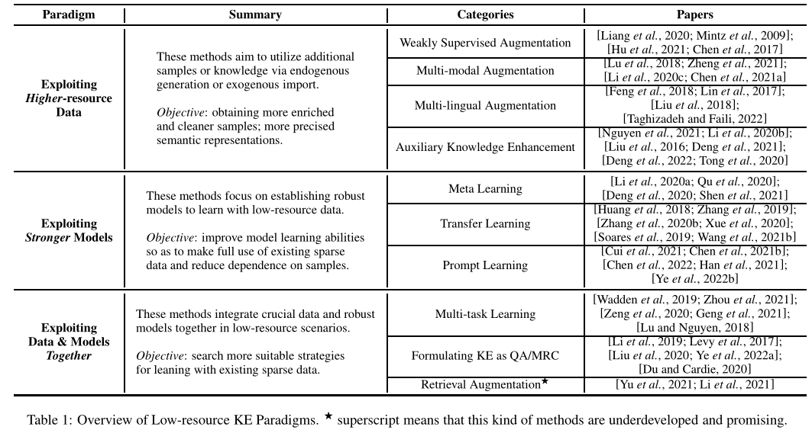

**1 利用高资源数据**

> 这种范式是指借助于内源性生成或外源性导入的辅助资源，对原始小样本数据进行数据扩充或知识增强。更高的资源数据有望产生更丰富、更干净的样本，以及更精确的语义表示。

弱监督增强是指通过弱/远程监督自动生成训练数据，旨在调整更多数据。这种方法利用一个知识库和一些启发式规则来自动重新标记企业中的状态。当然，生成的训练集可能包含很多噪声，这就是此类方法受到弱监督的原因。

- 多模态增强是指导入多模态样本，以补充文本中缺失的语义，帮助精确提取知识。直观地说，这种方法的主要挑战在于多模态的融合。

- 多语言增强是指导入多语言样本，与多模态增强类似，旨在获得更丰富、更稳健的样本表示。直觉上，这种方法的主要挑战是获得跨语言表达.

- 辅助知识增强意味着利用外部知识作为补救措施，旨在更准确地学习样本的语义表示（包括文本、知识图谱、本体&规则）。

**2 开发更强的模型**

> 这种范式指的是开发更健壮的模型，以更好地应对样本的不均匀分布和新的看不见的类。更强的模型有望提高学习能力，从而充分利用现有的小数据，减少对样本的依赖

- **元学习**通过从少量实例中学习，迅速吸收新知识，推出新课程，具有“学会学习”的能力，自然适合于少量任务。对于少样本NER，[Liet al.，2020a]实施了典型网络[Snellet al.，2017]，这是一种度量学习技术。它学习单词的中间表示，这些单词可以很好地聚集到命名的实体类中，使得它能够用极其有限的训练样本对单词进行分类，并且可以潜在地用作零样本学习方法。[Hanet al.，2018]将RE（尤其是长尾关系）表述为少样本任务，[Denget al.，2020]将有限标记数据的EE任务重新表述为几次学习问题。对于少样本RE而言，[Gao等人，2019a]为原型网络配备了混合注意，该注意由实例级注意和特征级注意组成，分别用于选择信息更丰富的实例和突出特征空间中的重要维度。[Quet al.，2020]提出了一种新的贝叶斯元学习方法，可以有效地学习关系原型向量的后验分布。关键思想是考虑全局关系图，它捕获关系之间的全局关系。

- **迁移学习**通过转移学习到的表示和模型，特别是从高到低的资源，减少了对标记目标数据的需求。在这个调查中，我们考虑基于类相关语义和预训练语言表示的迁移学习方法。（1） 类相关语义；（2） 预先训练的语言表达：基于预先训练的语言表示的迁移学习使用预先训练的语言表示，这些语言表示基于未标记的数据（如BERT）进行训练，并加载预先训练的参数进行微调。

- **提示学习**通常包括一个要求模型做出特定预测的模式和一个将预测转换为类标签的描述器。即时学习的核心思想是在输入中插入文本片段，即模板，并将分类任务转化为一个隐藏的语言建模问题。(1) Vanilla Prompt Learning (2)(2) Augmented Prompt Learning.

**3 同时利用数据和模型**

> 这种范式指的是联合使用代表性样本和稳健模型，使其易于迅速适应低资源场景。利用数据&个模型结合起来，有望在现有稀疏数据的情况下寻找更合适的学习策略。

- **多任务学习**通过联合利用任务通用共性和任务特定差异，同时学习多个相关任务，从而提高任务特定模型的学习效率和预测精度，这自然能够改善低资源场景中的目标任务。[Zenget al.，2020]研究了联合NER和RE任务，并提出了一个配备复制机制的多任务学习框架，允许模型预测多令牌实体。此外，该多任务学习框架能够区分RE任务中定义的头实体和尾实体，有助于准确提取实体。[Genget al.，2021]研究了联合NER和RE任务，提出了一种基于卷积神经网络和递归神经网络相结合的注意机制的端到端方法，该方法可以获得丰富的语义，并充分利用实体和关系之间的关联信息，而不引入外部复杂特征。

- 将KE描述为QA/MRC将KE任务描述为**问答（QA）/机器阅读理解（MRC）问题**，这意味着实体、关系和事件的提取转化为从上下文中识别答案的任务。事实上，问题查询可以暗示目标任务的关键知识。

- **检索增强**将检索集成到预训练语言模型中，因此，通过简单地更新用于检索的数据，模型可以更高效地使用参数，并有效地实现域自适应。

**一些基准数据集**

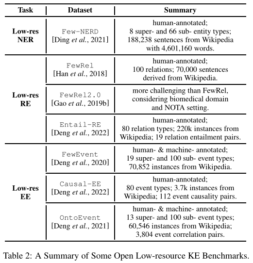

### Template-Based Named Entity Recognition Using BART (ACL2021)

#### 研究背景

> 神经网络NER需要大量的标签数据，在有些特定领域可能会有大量标签数据，但大部分领域都稀缺。理想情况，从源域转移知识是可行的。然而实际上不用域之间的实体类别是不同的。softmax 层和 CRF层要求训练和测试之间的标签集一致。因此，给定一个新的目标域，输出层需要调整，训练必须再次使用源和目标进行域，这可能是昂贵的。
>
> 转向基于度量的小样本NER研究。主要想法是基于源域中的实例训练一个相似函数，然后在目标域中使用这个相似函数作为最近邻准则。这种方法极大地降低了域适应的成本，特别是在目标域数量较大的情况下。但是有两个缺点：①目标域的标记实例被用来寻找启发式近邻算法的最佳超参数设置而不是更新NER模型中的参数。②过度依赖源域和目标域之间的相似文本模式。

#### 动机

- 现有的few-shot NER使用基于相似度的度量,不能充分利用NER模型参数中的知识迁移
- 基于微调的NER模型,进行领域迁移时,需要对输出层进行调整,必须使用源域和目标域再次训练,代价昂贵
- 目标领域的实体集合可能和源领域有很大差别,例如,新闻领域里提及一个人，类别往往是‘PERSON’，但是在电影领域，他的类别可能就是“CHARACTER”

提出一种基于模板的NER方法,将NER任务视为一个在seq2seq框架下的语言模型排名问题。

#### 背景知识

**少样本NER**

低资NER的标签集合可能不同于富有NER的。

**传统序列标注**

但是因为标签集不同，所以输出层的参数不同。我们需要在新的域从新训练输出层的参数。然而，这种方法确实没有充分利用标签关联（例如，“人”和“角色”之间的关联），也不能直接用于零样本情况，即目标域中没有可用的标签数据。

#### 本文提出的基于模板的方法

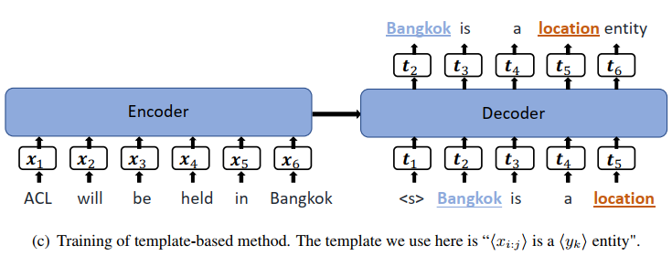

**人工模板构造**

正例和负例，1：1.5。不同模板具有不同的效果。

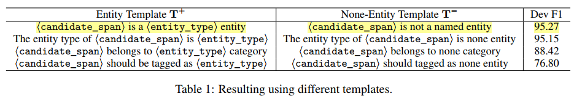

**模型推理**

我们首先列举句子{x1，…，xn}中所有可能的跨度，并将它们填入准备好的模板中。为了提高效率，我们将n-gram的数量限制在1到8之间，因此为每个句子创建8n个模板。然后，我们使用经过微调的预训练生成语言模型为每个模板Tyk分配一个分数

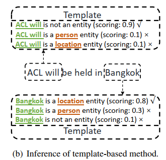

**训练过程**

喂给编码器的是原始的句子。第c步解码器的输入包括编码器的输出和上一时刻解码器的输出。第c步解码器的输出的词的概率为：

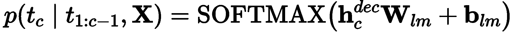

其中|v|表示预训练词汇表的大小。解码器输出和原始模板之间作交叉熵损失

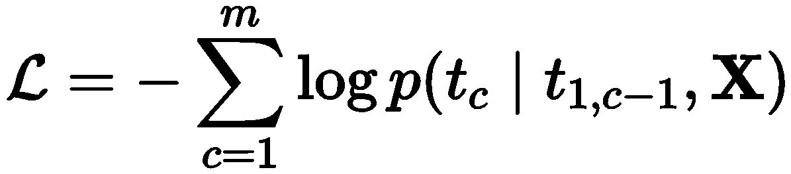

**迁移学习**

给定一个少样本实例的新领域P,标签集为$ L^P$ (可能包含与已经训练的NER模型不同的实体类型)

- 用新的标签集填充模板,得到少量的的 $\left(X^{P}, T^{P}\right)$ 序列对，模型其他部分不动。
- 对在富样本下训练的NER模型（也就是在CoNLL03上训练好的）进行微调。

输出的是一个自然句子,而不是一个标签,不管是富资源数据集,还是低资源数据集,标签都是在预训练模型中的子集。

模型学到了很多相关性信息,比如原来学习过实体类型的city,那么少样本情况下,有一个实体类型location,city的相关性,能够提升跨领域学习效果。

#### 实验结果

**数据集**

- CoNLL03作为富资源NER数据集

- MIT Movie Review,MIT Restaurant Review,ATIS作为少样本跨领域的数据集。

**CoNLL03数据集结果**

- 基于序列标注的BERT模型给出了一个起点很高的基线
- 即使基于模板的BART模型是被设计用作少样本NER,但是,在富样本设置下,表现得同样有竞争力…其中,召回率比基于序列标注的BERT模型高1.8%这表明这个方法确实能够提高识别实体的能力
- 通过对比基于序列标注的BART模型和基于模板的BART模型,可以发现,虽然都是使用BART Decoder,但是基于模板的方法效果明显更好,证明了基于模板方法的有效性
- BART序列分类做的不好可能原因是基于seq2seq的denoising autoencoder training

**领域内少样本NER**

1. 设定"MISC"和"ORG"为富样本实体,"LOC"和"PER"为少样本实体
2. 从CONNL03中下采样3806个训练样本,其中包含3925个"ORG",1423个"MMISRC",50个"LOC",50个"PER"

- 富样本实体类别识别中,和基于序列标注的BERT表现得一样好
- 少样本实体类别识别中,F1 分数显著的领先于BERT模型 , "LOC"和"MISC"分别高11.26,12.98

**跨领域少样本NER**

1. 从大的训练集中随机抽取训练实例作为目标域的训练数据,其中每个实体类型随机抽取固定数量的实例
2. 使用不同数量的实例进行训练

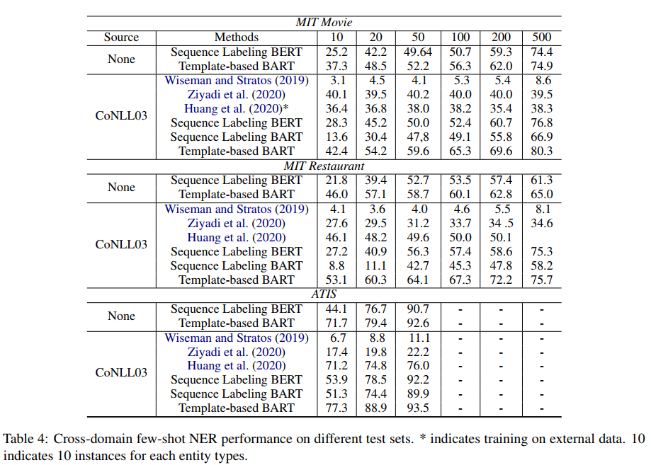

#### 结论

本文以BART为骨干网络,研究基于模板的少样本NER

- 当出现新的实体类别时,可以直接针对目标领域进行微调,这比基于序列标注的NER模型更强大
- 在富资源任务上,取得了有竞争力的结果;在低资源跨领域NER任务上,明显优于序列标注和基于距离的方法

### LightNER: A Lightweight Generative Framework with Prompt-guided Attention for Low-resource NER(AAAI2022)

> 本文对模型（代码的改进）在复旦邱锡鹏团队“*A Unified Generative Framework for Various NER Subtasks*”
>
> 本文对前人的工作的改进是基于~“*Template-Based Named Entity Recognition Using BART*”的缺点进行创新的。

**摘要**

大多数现有的NER方法依赖于大量有标签的数据，这在训练数据有限的低资源场景中很难实现。最近，针对预训练语言模型的“提示+微调”的方法，利用提示作为任务知道来减少预训练任务和下游任务调整之间的gap，在少样本场景下取得了显著的效果。受到提示学习的启发，我们提出一种新的轻量级的生成框架，该框架具有提示引导的注意力机制用于低资源NER。具体而言，我们构建了语义感知的实体类别答案空间，以便在没有任何特定分类器的情况下快速生成实体span和实体类别。我们进一步提出了提示引导注意力机制，将连续的提示纳入到自注意力层，以便重新调节预训练的权重。请注意，我们只在预训练语言模型的整个参数固定的情况下调整这些连续提示，因此，我们的方法对于低资源场景来说是轻量级和灵活的，并且可以更好地跨域传递知识。实验结果表明，在标准监督设置下，LightNER可以获得相当的性能，在低资源设置下，只需调整一小部分参数，其性能就会优于强基线 。

**前言**

- BERT-分类器的方法不适用于不可见类，因此需要重新训练。
- 原型网络方法减少了域适应的代价，然而这些方法主要侧重寻找最佳的超参数设置，以利用源域和目标域之间的相似模式，而不是更新NER的网络参数。
- 基于提示学习的方法想去弥补下游任务和预训练语言模型之间的gap。
- 直观的说：提示学习方法适应于小样本NER！
- “*Template-Based Named Entity Recognition Using BART*”是第一个针对少样本NER提出基于BART构建模板的方法。但是这篇文章有2个不足之处：（1）手工构建的模板比较敏感。（2）计算复杂度高。需要枚举n-gram去填充构建的m个模板。
- 因此针对上面2个不足提出了本文的idea（做成改进）。具体而言改进如下：（1）也是基于BART的seq2seq模型（这点不算改进，但是是优点可以解决不可见类的问题，不用重新构建特定的分类器）；（2）连续的提示表征向量可以学习，而不是手工构建的模板；（3）轻量级（计算复杂度低），不更新预训练语言模型的参数，只更新连续提示向量和答案空间的权重。

**方法**

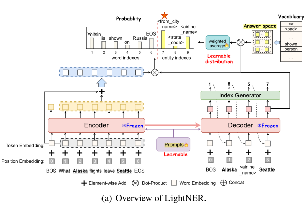

- [x] 任务构建

输入序列：$$ X={x_1,x_2,...,x_n}.$$NER任务旨在提供实体范围的开始索引和结束索引，以及实体类型，在我们的框架中分别由e、t表示。其中e是token的索引，$t \in\{$ person, organization，..., $\}$。在我们的生成框架中，目标序列Y由多基预测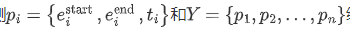组成。 

给定令牌序列X，条件概率计算如下：
$$
P(Y \mid X)=\prod_{t=1}^{n} p\left(y_{t} \mid X, y_{0}, y_{1}, \ldots, y_{t-1}\right)
$$

- [x] 生成框架

过程和Template-Based Named Entity Recognition Using BART类似，参考之即可。

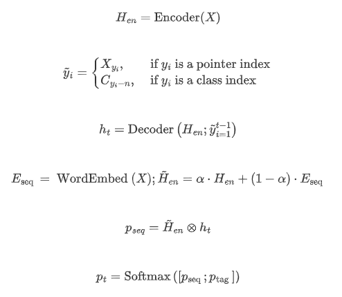

- [x] 为提示学习构建语义感知的答案空间

**Q**:为何要构建？前人的基于特定类别的有何缺点？

**A**:现有研究（Liu等人，2021c；Le Scao和Rush，2021）表明，answer工程对“提示-微调”的性能有很大影响。对于NER中实体类别的预测，添加表示不同实体类型的额外*标签特定*的参数将阻碍快速学习的适用性，并损害低资源NER中类间的知识转移。同时，手动在词汇表中找到合适的标记来区分不同的实体类型也是一个挑战。 此外，某些实体类型在特定的目标域中可能很长或很复杂，例如return_date。TIS中的month_name和MIT restaurant中的restaurant_name。 **为了解决上述问题，我们构建了包含与每个实体类相关的多个标签词的语义感知的答案空间**，并利用加权平均方法答案空间V。具体而言，我们定义了从实体类别C的标签空间到语义感知答案空间V的映射M，即M:C->V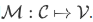我们使用$V_c$表示V的子集，该子集由特定的实体类型c映射，$\cup_{c \in \mathcal{C}} \mathcal{V}_{c}=\mathcal{V}$。以上述c1=“return_date.month_name”为例，我们根据c1的分解定义Vc1={“return”、“date”、“month”、“name”)。由于直接平均函数可能存在偏差，我们采用可学习权重α对答案空间中标签词的logit进行平均，作为预测logit :

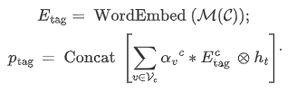

$\alpha_{v}{ }^{c}$表示实体类型c的权重。**通过构建语义感知的答案空间，LightNER可以在不修改PLM的情况下感知实体类别中的语义知识**。 

- [x] 提示引导的注意力机制

“参数设置”

具体而言，LightNER分别为编码器和解码器添加两组可训练的嵌入矩阵$\left\{\phi^{1}, \phi^{2}, \ldots, \phi^{N}\right\}$，并将transformer层数设置为N，其中$\phi_{\theta} \in \mathbb{R}^{2 \times|P| \times d}$（由θ参数化），| P |是提示的长度，d代表dim(ht)，2表示φ是为Key和Value设计的。在我们的方法中，LM参数是固定的，提示参数θ和α的可学习分布是唯一可训练的参数。 

“提示引导的注意力层”

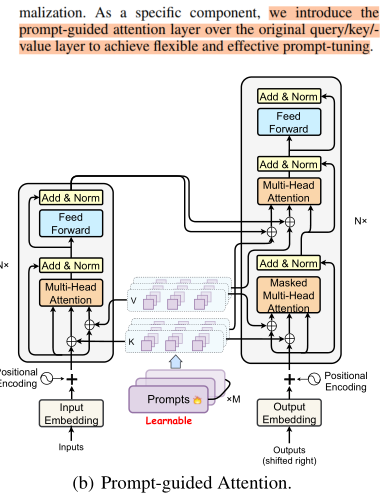

LightNER继承了transformer的架构，它是一堆相同的构建块，用前馈网络、剩余连接和层规范化包裹起来。作为一个特定组件，我们在原始query\key\value层上引入了提示引导注意层，以实现灵活有效的提示调整。 

给定一个输入标记序列X={x1，x2，…，xn}，按照上述公式，我们可以将提示的表示与自我注意的计算合并到X中。在每个层l中，输入序列表示$X^l∈ R^d$首先投影到query\key\value向量中 :

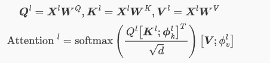

所提出的提示引导注意可以根据提示词重新调节注意的分布。因此，该模型得益于提示的指导 .

**实验结果**

> 实验设置和*Template-Based Named Entity Recognition Using BART*的实验设置是基本保持一致的。

- [x] 标准的监督场景NER（CoNLL03数据集）

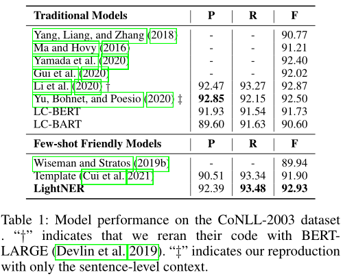

- [x] 域间少样本场景NER（CoNLL03数据集）

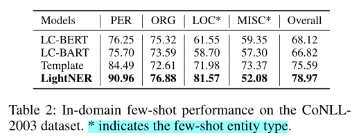

MISC指标有误。

- [x] 跨域少样本场景NER（MIT Movie、MIT Restaurant、ATIS）

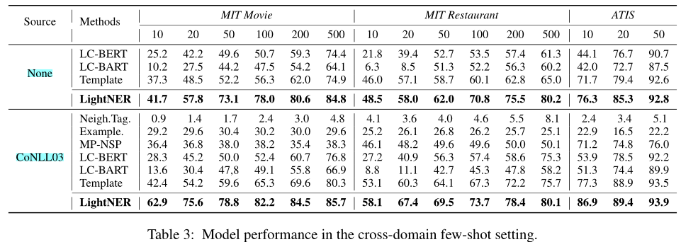

- [x] 消融实验

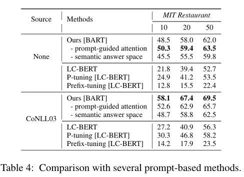

- [x] 零样本场景

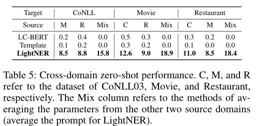

**结论和未来工作**

在本文中，我们提出了一种新的具有即时引导注意的生成框架（LightNER），它可以用很少的样本来识别看不见的实体。通过为PrompTuning构建实体类型的语义感知答案空间，LightNER可以保持一致的预训练和微调过程。同时，提示引导注意的设计可以更好地跨领域传递知识。我们的模型在参数方面是有效的，只需调整提示参数。实验结果表明，LightNER在资源丰富的情况下可以获得有竞争力的结果，在资源较少的情况下优于基线方法。**未来，我们计划探索更复杂的方法来增强提示，并将我们的方法应用于低资源环境中的更多任务.**。

### InstructionNER： A multi-task instruction-based generative framework for few-shot NER(Arxiv 2022)

> 试图激发预训练语言模型潜力的方法有2种：①是基于提示学习的方法；②是基于指令的方法

**摘要**

> 最近基于提示学习的方法在少样本场景下取得了很好的效果，主要是通过消除语言模型的预训练和下游任务的微调之间的gap。**然而，现有的提示需欸模板大多数是为句子级别任务设计的，不适于序列标注目标**。为了解决上述问题，我们提出了多任务基于指令的生成式框架，InstructionNER。具体来说，我们将NER任务重新表述为一个生成问题，该问题使用特定于任务的指令和答案选项丰富源语句，然后推断自然语言中的实体和类型。 我们进一步提出了两个辅助任务，包括实体提取(entity extraction)和实体类型(entity typing)，分别使模型能够捕获更多实体的边界信息和加深对实体类型语义的理解。实验结果表明，在五个数据集上，我们的方法在很少的镜头设置下始终优于其他基线。 

**解决NER的四种范式**

序列标注：不幸的是，在现实世界中，用于标记的注释资源往往稀缺且昂贵。

基于模板：尽管基于提示的学习方法在数据稀缺的情况下取得了优异的性能 。然而现有的大多数基于模板的方法都是为句子级别任务设计的，很难适应序列标注问题。因此，需要将传统的NER范式重新制定为更适合PLMs的方式，以便将快速学习方法应用于NER任务。 最近Cui提出的**Template-based**（图1b）将NER问题转换为完形填空的形式。虽然由于引入了提示，该方法在少样本场景中的性能优于传统的序列标记基线，但它需要枚举所有跨候选序列，这既不美观又耗时。 

BART-NER的：（复旦邱锡鹏团队）BART-NER（如图1c所示）提出了一种基于指针的seq2seq体系结构，该体系结构将NER子任务转换为统一的序列生成任务，并从输入句子和相应的类型索引中预测实体 。**LightNER**（Chen等人，2021）对**BART-NER**的注意机制进行了快速调整，并在低资源场景中取得了有希望的改进。 

基于指令的（本文的方法）：受TemplatedNER（设计特定提示模板作为解码器输入）和LightNER（将额外参数作为软提示引入注意层）的启发，我们提出了这样一个问题：**如果我们用启发式提示丰富生成性PLM的源语句，这能更好地激发在预训练阶段学习的语义知识并完成低资源的NER任务吗？** 

这就是本文作者Idea的产生，为了解决这样的问题，作者有啥如何处理的?

> 为此，我们提出了一个基于多任务指令的生成框架，名为InstructionNER，用于解决少样本NER。具体来说，我们将NER任务重新表述为一个自然语言生成问题（如图1d所示）。对于源语句，我们设计了描述性说明，使模型能够理解不同的任务（Wei等人，2021），并采用了一种选项机制，包括所有候选实体类别作为输出空间的约束。 然后，为了进行推理，需要T5以自然语言的形式生成实体词和相应的类型，因为我们认为，**无限制的解码**将激发PLM的潜在知识，从而在更大程度上完成实体提取和识别任务。此外，我们还介绍了两个辅助任务，命名实体提取（EE）任务和实体类型化（ET）任务。 EE要求模型只解码实体名称，并学习更好地捕获边界信息。ET旨在预测实体类型并增强PLM对类型语义的理解 

本文贡献总结为：

- 1） 为了充分利用语言模型中的知识，我们将NER任务重新表述为一个新的seq2seq问题，该问题将描述性任务说明和答案选项集成到源语句中，然后要求模型预测自然语言中的实体名称和类型。
- 2） 此外，我们还提出了两个辅助任务，可以增强捕获实体边界的能力和对类型语义的理解。
- 3） 在三个NER基准上的实验表明了我们提出的方法的有效性，尤其是在数据稀缺的情况下。此外，我们还进行了深入的分析，以展示我们的方法的更多特点。 

**相关工作**

简述一下

- NER任务：最流行的表述为序列标注任务，在句子编码器后接一个分类器或者CRF。但是仅仅适用于平滑的NER，不适合嵌套场景。因此复旦邱团队受预先训练的seq2seq模型最近成功的启发提出了BART-NER，将所有三种NER子任务重新表述为生成问题，并使用BART为推理实体及其类型索引建立了基于指针的框架。**受这种新范式的启发，我们将NER视为自然语言生成任务，其中模型需要以自然语言的形式生成实体名称和相应的类型。此外，我们采用T5代替BART作为基础模型，因为T5的预训练任务是预测损坏令牌的序列，这更适合我们的公式。** 
- 提示学习：动机是充分利用预训练语言模型学习到的知识。另外有一种激发预训练语言模型潜能的方法是基于指令的。我们结合两者提出模板指令。
- 基于提示的少样本NER：Template-Based、LightNER。

**本文的方法**

- [x] 问题的定义

输入序列：

识别：,l表示左边界，r表示右边界，t表示实体类型。

为简单起见，我们使用xl:r表示x从左边界l到右边界r（包括）的跨度，即xl:r={wl，…，wr}。

- [x] 通过T5解决NER

为了更好地转移和利用在预先训练的语言模型中学习到的知识，我们将NER任务重新格式化为seq2seq形式，并通过微调T5解决它，如图2所示 。

具体而言，对于**主任务**（如图2中的橙色方框所示），每个输入由以下三个字段组成： 

- Sentence:原始句子
- Instruction：该指令告诉模型当前示例所属的任务。对模型进行训练，以生成与指令一致的预期输出。对于主NER任务，指令为：***please extract entities and their types from the input sentence, all entity types are in options***.
- 选项：所有实体类型T，用逗号分隔。此字段同时充当提示和约束，以提醒模型需要识别哪些实体类型。

为了激发预训练模型的潜力，我们将输出组织成自然语言形式，自然地响应输入命令。具体来说，对于实体出现（l、r、t），我们使用模板将其转换为自然语言形式：xl:r 是a/an t，并将所有转换的实体出现连接在一起，组成一个输出句子（使用逗号作为分隔符，以点结尾）。

**辅助任务**为了在更细粒度的级别上提高性能，我们进一步设计了两个辅助任务，即实体提取和实体类型，这两个任务正是构成整个NER任务的两个细粒度子任务。我们与这些辅助任务一起训练模型。 

对于**实体提取任务**，训练模型从给定句子中提取实体跨度，但不需要键入它们。我们将指令字段替换为***please extract entity words from the input sentence*** ，并删除选项字段，因为不需要键入提取的跨度。此外，输出应仅包含提取的跨距，并删除“is a /an t”。实体提取任务是主任务的简化。该模型在指令的指导下，只需从句子中提取实体，而不需要关注所提取实体的类别信息，这对提高实体提取的广度F1有很大帮助。span F1的改进意味着增强了从句子中正确提取实体的能力，从而提高了NER主任务的准确性。 

对于实体类型任务，将对模型进行训练，以type句子中给定的实体。具体来说，我们将输入示例的指令字段替换为***please typing these entity words according to the sentence: 《the given entity occurences》***，其他字段和输出与主任务相同。在训练阶段，随着句子中实体出现次数的给定，我们期望该模型更多地关注实体出现的类别语义信息。这鼓励模型生成更准确的类别标签，同时保持在主NER任务中生成实体引用的准确性，从而提高NER的性能。

**实验部分**

### NNACL2022华为中文NER最新SOTA--Delving Deep into Regularity: A Simple but Effective Method for Chinese Named Entity Recognition

> 现在很多基于填表方式的NER方法，在构造表中元素的时候，一般用的都是由相应span的head字和tail字的表征得到的，而本文在此基础上加入了从span中所有字的表征中抽取出来的特征

**1.论文出发点**

中文没有天然的单词边界，所以中文的的NER比英文的还要难一些。这两年NER有一个很好的点子就是引入外部词典，显式的告诉模型哪些字的组合在中文中是一个词，从而给模型注入一些先验的字与字之间的关系，取得了很好的效果，比如Lattice LSTM、FLAT、LEBERT等。但这类方法都需要提供一个外部词典，外部词典的质量就尤为重要了。本文的想法就是**「不依赖外部字典，让模型自己去学习实体内字与字之间的关联，以及实体之所以会是某一个类型的实体的规律」**。为了实现这个想法， 本文提出了两个idea：

- **「探索实体内部的组成规律——“命名规律性”，用来增强实体的边界监测和类型预测。」**

本文的作者们发现很多常规实体类型（LOC、ORG等）都有“**「命名规律性」**”，就是说**「某个实体类型的mentions都有某种内部的构成模式，如果模型学习到了这种内部的构成结构，那么对于识别实体的边界以及预测实体的类型会有一定的帮助」**。举个例子，比如以“公司”或者“银行”等词结尾的实体，一般就是ORG，再比如，图1中“尼日尔河流经尼日尔与尼日利亚”中就有一个规律，“XX+河”大部分情况下就是和地理位置相关的实体类型（LOC），虽然“流”字的右边是“经”也可以组成“流经”这个词，导致“流”字这里有边界模糊问题，但是如果模型可以学到“XX+河”这个命名规律，那么大概率还是会把"尼日尔河"作为一个实体识别出来的。

- **「利用上下文来缓解仅依赖命名规律性无法完全确定实体边界的问题」**

有的时候仅依赖命名规律性，可能会造成一些冤假错案，这时候**「可以通过上下文来缓解命名规律性对边界的决定性影响」**，比如图1中“中国队员们在本次比赛中取得了优异成绩”中，XX+队是一个pattern的话，但实际上实体是并不是“中国队”，这时候只利用命名规律性来判别实体边界和类型就会出问题，需要看上下文了。

可以看出，本文的方法是要在上两者之间取一个平衡。

**2.RICON模型**

本文提出的这个模型叫做**「R」**egularity-**「I」**nspired re**「CO」**gnition **「N」**etwork (**「RICON」**)，采用是**「填表」**的方式进行标注，也就是搞一个word-word表，表中每一个元素表示相应的span是什么类型的实体。

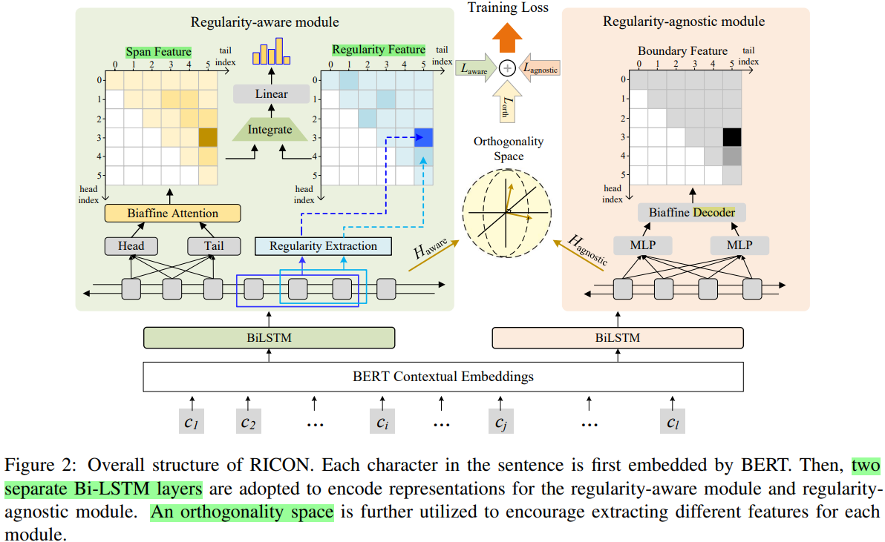

如上图所示，模型主要有两个模块：

- **「Regularity-aware Module（规律感知模块）」**：这个模块负责分析span内部的规律，进而获取结合了规律的span表征，然后用于实体类型的预测；
- **「Regularity-agnostic Module （规律判断模块）」**：这个模块主要获取span上下文的表征，然后用于判断这个实体到底是不是一个实体。

除此之外，模型使用了**「BERT+BILSTM」**做文本的表征和编码，还使用了**「正交空间限制」**（Orthogonality Space Restriction），来让上面两个模块编码不同的特征。下面具体介绍一下。

- [x] **2.1Embedding和特定于任务的编码器**

给定一个有![[公式]](https://www.zhihu.com/equation?tex=+l+)个字的句子![[公式]](https://www.zhihu.com/equation?tex=+s%3D%7B+c_%7B1%7D%2C+c_%7B2%7D%2C+...%2C+c_%7Bl%7D+%7D+)：

1. 先过BERT，取得每一个字的上下文表征![[公式]](https://www.zhihu.com/equation?tex=+x_%7Bi%7D+%3D+BERT%28c_%7Bi%7D%29+)；
2. 然后分别过两个独立的BiLSTM，将每个字的前后向hidden_state拼接起来，分别获取句子的char序列的aware-specific representation ![[公式]](https://www.zhihu.com/equation?tex=+H_%7Baware%7D+)和agnostic-specific representation ![[公式]](https://www.zhihu.com/equation?tex=+H_%7Bagnostic%7D+)。![[公式]](https://www.zhihu.com/equation?tex=+H_%7Baware%7D+)会被送入规律感知模块，![[公式]](https://www.zhihu.com/equation?tex=+H_%7Bagnostic%7D+)会被送入规律判断模块。![[公式]](https://www.zhihu.com/equation?tex=+H_%7Baware%7D%2CH_%7Bagnostic%7D%5Cin%5CRe%5E%7Bl%5Ctimes2d%7D+)，其中d是LSTM的unit的数量。

- [x] **2.2规律感知模块 Regularity-aware Module**

这个模块主要是负责分析span内部的规律，进而获取结合了规律的span表征，然后用于实体类型的预测。想要获取**「结合了规律的span的表征」**，本文采用的方式是分而治之：如下图所示**「找到span的内部规律特征——Regularity Feature，以及span的特征——Span Feature，然后把二者结合起来去做实体类型的分类」**。

**Span Feature的获取**

我们先来看几种填表类型NER方法中span特征的生成以及实体类型分类的方式：

- Head-Tail拼接做span表征，然后用线性分类器分类，如上图(a)，但这种就有点简单；
- Biaffine 分类器的方式（《Named Entity Recognition as Dependency Parsing》），如上图(b)，将head和tail的表征分别过不同的MLP，然后用双仿射分类器去做实体类别的分类，达到了SOTA；
- 第三种是本文中提出的，Regularity-aware表征过线性分类器，我们稍后会介绍；
- 这里我再加一种，就是我上一篇介绍的[W2NER](https://link.zhihu.com/?target=https%3A//mp.weixin.qq.com/s/unHH0ak9P_XCfEbaeVeXog)中用的方式：CLN+空洞卷积；

本文在获取Span Feature的时候**「主要用的是Biaffine方式的变种」**，表内的每个位置![[公式]](https://www.zhihu.com/equation?tex=+%5Bi%2C+j%5D+)所表示的span（第![[公式]](https://www.zhihu.com/equation?tex=i)个字是span的head，第![[公式]](https://www.zhihu.com/equation?tex=j)个字是span的tail）的特征为 ![[公式]](https://www.zhihu.com/equation?tex=h%5E%7Bspan%7D_%7Bs_%7Bi%2Cj%7D%7D)：

![[公式]](https://www.zhihu.com/equation?tex=h%5E%7Bspan%7D_%7Bs_%7Bi%2Cj%7D%7D%3Dh%5E%7BT%7D_%7Bi%7DU%5E%7B%281%29%7Dh_j+%2B+%28h_%7Bi%7D+%5Coplus+h_%7Bj%7D%29U%5E%7B%282%29%7D%2Bb_%7B1%7D+%5C%5C)

其中![[公式]](https://www.zhihu.com/equation?tex=+h_%7Bi%7D%2C+h_%7Bj%7D+%5Cin+H_%7Baware%7D)，分别是![[公式]](https://www.zhihu.com/equation?tex=+span_%7Bi%2Cj%7D+)head和tail字的表征。![[公式]](https://www.zhihu.com/equation?tex=+U%5E%7B%281%29%7D+)是一个![[公式]](https://www.zhihu.com/equation?tex=2d%2A2d%2A2d)的张量，![[公式]](https://www.zhihu.com/equation?tex=+U%5E%7B%282%29%7D+)是一个![[公式]](https://www.zhihu.com/equation?tex=4d%2A2d)的矩阵，那么![[公式]](https://www.zhihu.com/equation?tex=h%5E%7Bspan%7D_%7Bs_%7Bi%2Cj%7D%7D)就是一个维度是![[公式]](https://www.zhihu.com/equation?tex=+2d+)的向量。

这里大家可以看到本文用的Biaffine方式没有用它前面的那俩MLP，原因是MLP会把头尾投影到不同的空间里面，效果不好，论文也通过实验证实了用MLP效果相较于不用，有所下降（下表中Apply MLPs to head and tail）。

 **Regularity Feature的获取**

上面提的几种span特征生成方式都用的是span的头和尾，而想要分析span内部的规律，仅用头和尾那是肯定不够的，所以在本篇论文里面，**「用了span内的所有字，用一个线性attention来计算每个字的权重，然后对字的表征进行加权求和得到span内部的规律性特征」**![[公式]](https://www.zhihu.com/equation?tex=h%5E%7Breg%7D)。此外，对于长度是1的span，也就是单字span，就用它自己的表征作为这个span的规律性特征。

当然，关于这个规律怎么抽取，论文中也做了一些其他的尝试，简单的有max pooling/ mean pooling，复杂的有multi-head self-attention，但效果都不是很好（详见上面的“不同实验方案的对比表”），并且文中表示这是未来的一个可探索的方向。

这里我说一下我关于这种规律性特征抽取方式的一些想法（可能不对哈）：

> ❝ 公式中的![[公式]](https://www.zhihu.com/equation?tex=W%5E%7BT%7D_%7Breg%7D) 是一个可训练的参数向量，看公式它会与所有字的表征向量相乘，分别得到一个标量数字，那我可不可以认为这个![[公式]](https://www.zhihu.com/equation?tex=W%5E%7BT%7D_%7Breg%7D) 就是**「代表着某种神秘的实体规律」**，与字的表征做內积，结果越大，那这个字与实体规律越契合，然后用这个得到的內积标量在span的局部内用softmax做权重的计算，将命中规律的字在span中突显出来。
> 怎么说呢，给我的感觉就是通过这种方式并没有很透彻的分析span内部的规律，只是将句子中命中了实体规律（也不管命中的是不是同一种实体规律）的字在它所在的span中给凸显出来（比如最开头举例的XX+河的模式中的“河”字，以及中国队员中的XX+队的“队”字），也就是说它只考虑了规律，其他基本没考虑。哦当然，我这个想法是没考虑前面的BERT+BILSTM，因为BERT+BILSTM并不是这篇论文的核心创新点。我认为这也是上面作者们会认为过分强调“命名规律性”会导致会对边界造成不好影响的一个原因吧。所以这个抽取出来的特征不能单独作为span的表征，需要用分而治之的思路，结合Biaffine-based span Feature来判断边界，还又单独加了一个“规律判断模块”来根据上下文判断这个规律到底是不是一个真正的规律。
> 这里再开一个小小的脑洞，如果想要探索span的内部规律，更直观的想法是让span内部的字之间发生交互，我们首先生成一个word-word table，其中每个位置是他们两两交互的表征，比如用CLN，然后用大小为[1, 1], [2, 2], …, [L, L]的卷积核去提取span的表征，卷积核只在对角线上滑动（比如需要获取span(3, 5)的表征，那么就用一个大小为3*3的卷积核提取特征，这个卷积核刚好覆盖住table中的(3, 3), (3, 4), (3, 5), (4, 3), (4, 4), (4, 5), (5, 3), (5, 4), (5, 5)这几个全部都是这个span内的字两两交互的位置），卷积核抽取的特征（再加点非线性变换)作为它右上角的元素表示的span的表征，感觉是不是也可以直接作为结合了span内部规律的span表征了呢？但是文本是变长的，那不能规定所有尺寸的卷积核吧？这个处理起来也不太好处理，这个方案有没有大佬觉得有搞头的~
> ❞

 **整合Span Feature和Regularity Feature**

**「利用门控机制整合Span Feature和Regularity Feature」**，获取整合了规律性特征的span表征![[公式]](https://www.zhihu.com/equation?tex=+h_%7Bs_%7Bi%2Cj%7D%7D+)，具体就是这俩Feature拼接，然后线性映射，然后过sigmoid获取span特征的权重![[公式]](https://www.zhihu.com/equation?tex=+g_%7Bs_%7Bi%2Cj%7D%7D+)，Regularity特征自然就是![[公式]](https://www.zhihu.com/equation?tex=+1-g_%7Bs_%7Bi%2Cj%7D%7D+)了，然后加权求和得到span表征![[公式]](https://www.zhihu.com/equation?tex=+h_%7Bs_%7Bi%2Cj%7D%7D+)：

关于这部分，作者们也尝试了将Span Feature和Regularity Feature拼接或者相加作为span表征的方式，但效果均不如用门控机制好。

**分类器和loss**

- 分类器：对span表征用一个线性分类器预测每个span的类型

- Loss Function用的是CE

**Case Study**

关于这个模块的效果，我们来看一个例子，如下图所示，“波罗的海”，如果用vanilla方法（BERT+BILSTM+本模块中的Span Feature部分）预测成了GPE，而Vanilla+Reg-aware方法（BERT+BiLSTM+本模块）就可以预测正确为LOC，且门控机制给Regularity Feature的打分是0.83。

- [x] **2.3规律判断模块 Regularity-agnostic Module**

作者们认为regularity-aware module让模型很严格的按规律去预测实体类型，可能会导致precision的增长，但是正如上文中介绍的例子，太严格遵守规律，可能会导致对边界判定出问题，所以他们加了这个模块。在这个模块中不考虑span内的具体形式，而是更注重上下文，所以他们选择了位于边界处的头和尾字下手，他们的**「目标是：用head 和 tail feature来判断这个span是否是一个entity」**（所以是BILSTM发威了么）。

1. 对agnostic-specific representation ![[公式]](https://www.zhihu.com/equation?tex=+H_%7Bagnostic%7D+)，分别过两个MLP（一个head MLP，一个tail MLP），得到head表征和tail表征。

2. 然后依然是组一个![[公式]](https://www.zhihu.com/equation?tex=+l%2Al+)的表格，然后每个表格内的元素![[公式]](https://www.zhihu.com/equation?tex=%28i%2Cj%29)表示第![[公式]](https://www.zhihu.com/equation?tex=i)个字为head，第![[公式]](https://www.zhihu.com/equation?tex=j)个字为tail的span是一个entity的概率，计算方式是双仿射解码：

3. Loss Function用的是BCE

**Case Study**

- [x] **2.4 Orthogonality Space Restriction**

上面的两个模块，规律感知模块感知规律，规律判断模块并不考虑任何规律，那么自然希望这俩模块学习到的是不同的特征。所以为了鼓励这俩模块别学同样的特征，作者们在Task-specific Encoder，也就是最开头的那俩BILSTM的后面，构造了一个正交空间，争取让这俩模块编码input embedding的不同方面。

具体就是用最开头那俩BiLSTM的输出进行矩阵乘法，然后用Frobenius范数的平方（F-范数）作为loss。

公式中的![[公式]](https://www.zhihu.com/equation?tex=+%5ClVert+%5Ccdot+%5CrVert%5E%7B2%7D_%7BF%7D) 就是F-范数的平方，F-范数其实就是矩阵中每个元素的平方和的开方，类似于向量的L2范数，它用来衡量矩阵大小（到原点（零矩阵）的距离），看定义是不小于零的。所以上面*论文里的公式应该没有那个负号吧，作者是不是打错了*。我理解其实这个模块就是希望aware所在的空间和agnostic所在的空间是两个正交子空间，一个子空间中的任意一个向量与另一个子空间中的任意一个向量都是正交的，內积是0，那么两个矩阵相乘的这个![[公式]](https://www.zhihu.com/equation?tex=H_%7Borth%7D)自然是希望它的大小（F-范数)是冲着零去的。

- [x] **2.5 训练和推断**

- 最终loss
  ![[公式]](https://www.zhihu.com/equation?tex=L%3D%5Clambda_%7B1%7DL_%7Baware%7D%2B%5Clambda_%7B2%7DL_%7Bagnostic%7D%2B%5Clambda_%7B3%7DL_%7Borth%7D+%5C%5C) 其中![[公式]](https://www.zhihu.com/equation?tex=+%5Clambda_%7B1%7D%2C+%5Clambda_%7B2%7D%2C+%5Clambda_%7B3%7D+)是三个超参数，论文的实验中分别设定为1、1、0.5。
- 推断
  推断的时候直接使用regularity-aware module去预测每个span的实体类型，如果碰到重叠的结果，比如![[公式]](https://www.zhihu.com/equation?tex=+E_%7B1%2Cstart%7D+%3C+E_%7B2%2Cstart%7D+%3C%3D+E_%7B1%2Cend%7D+%3C+E_%7B2%2Cend%7D+)，则他们选择分数更高的那个。也就是说Regularity-agnostic Module其实是个辅助模块咯。

**3.实验结果**
- [x] **3.1数据集**

文中实验用了如下几个数据集：

- [x] **3.2效果**

可以看到，本文提出的RICON在多个数据集上F1均达到了SOTA，效果还是不错的，总的来说Recall涨幅还挺大的。

- [x] **消融实验**

- Vanilla：就是只有规律性感知模块的Span Feature部分，其他的都没有

- +Reg-agnostic：Vanilla加上规律判断模块（判断每个span到底是不是一个实体），f1略有增长

- +Reg-aware：Vanilla加上规律感知模块中的Regularity Feature部分，发现Precision提升了，但recall下降了，但是整体F1有显著增长，说明加了感知模块以后，确实增强了实体类型的预测，但是同时导致一些本该是实体的span被漏掉了。

- - 但其实我也很想看看BERT+BiLSTM+Regularity Feature部分的效果

- +Reg-aware & agnostic：两个模块都加上，效果有进一步提升，相较于+Reg-aware，Recall提升了很多，说明猜疑部分可以加强边界的判定。

- 最后RICON是上一个实验再加上正交空间限制，效果又进一步有提升。
- 
- [x] **分析**
- 论文中提出的RICON，作者认为他们探索的规律性其实是一个**「latent adaptive lexicon」**，比之前的一些融入了Lexicon的方法效果要好一些。
- 文中有+Reg-aware的方法与Vanilla方法在单个实体上做了对比，如下图，发现在GPE、ORG、DATE等有明显命名规律性的实体上，+Reg-aware方法有提高，而在PERSON等没啥命名规律性的实体上，就有下滑。此外对于MONEY这种有规律性的，居然也下滑了，原因是因为训练集里都是“数字+dollar”，但测试集里都是只有数字（通过+Reg-agnostic模块来缓解）。说明了“命名规律性”特征的抽取确实有用，而且**「这个模型其实也可以用来做“命名规律性”强弱的判别」**。

### 南洋理工&阿里达摩院NER数据增强技术EMNLP2020[DAGA: Data Augmentation with a Generation Approach for Low-resource Tagging Tasks])

**简介**

我们都知道，NER是一个token-level的任务，缺乏sentence-level任务较为稳定的数据增强方法，在进行全局结构化预测时，一些增强方式产生的数据噪音可能会让NER模型变得敏感脆弱，导致指标下降、最终奔溃。

DAGA这篇论文来自南洋理工及阿里达摩院，发表在EMNLP2020上。DAGA基于语言模型研究数据的扩充方法，首先将标记的句子线性化，如下图1所示。然后对[线性化]后的数据训练语言模型(LM)，用于生成合成标记数据。具体来说，将一对单词及其标签(如“B-PER Jose”)一同训练，LM将在生成过程中选择概率高的标签词对。

通过标注数据训练语言模型

论文中的序列标注模型采用BiLSTM+CRF，其结构如下

**数据序列化**

将有标记的句子转换成线性序列，这样就可以使用语言模型来了解标注数据中单词和标签的分布情况。如图1所示，在线性化过程中，标签被插入到对应单词的前面，作为这些单词的修饰语。对于带有频繁O标签的任务，会将这些标签从线性化序列中移除，除此之外还会有一些特殊的处理方式，比如碰到的数字，会用「N」来代替等。

句子线性化后，分别在每个句子的开头和结尾添加特殊token，[BOS]和[EOS]。

除了可以对标注数据进行序列化之外，还可以对无标注数据以及包含知识谱图的数据进行序列化，如下图3所示。

**合成数据的生成**

合成的数据通过LSTM模型生成，为了保证生成数据的[泛化性]，每次模型输入的第一个token都为[BOS]，从第二个token开始，从较高概率的token中随机选择一个，这样就可以生成较多的合成数据。

**论文实验**
- [x] 监督场景下

实验数据选择CoNLL2003，共采用4种实验设置，每组实验生成数据量1k

- **gold**：通过标注语料进行NER训练
- **gen**：即DAGA，1）通过标注语料进行语言模型训练、生成新的数据:2) 过采样标注语料; 3)新数据+过采样标注语料，最后一同训练NER
- **rd**：1)通过随机删除进行数据增强; 2)过采样标注语料；3)新数据+过采样标注语料，最后一同训练NER
- **rd\***：同rd，只是不过采样标注语料

对比情况如下

从上表可以看出：**DAGA明显超过其他数据增强方法，特别是在低资源条件下**（1k和2k数据量）。

下表是我自行复现的结果，实验变量比较多，我只实验了一小部分：

**在加入DAGA方法后，数据确实有所增强，尤其在低资源情况下，增强比较明显，但是在数据量较为充足的情况下，不是很理想。**

- [x] 半监督场景下

实验数据选择CoNLL2003 English NER，共采用5种实验设置：

- **gold**：通过标注语料进行NER训练
- **wt**：即弱监督方法，采用标注语料训练好一个NER模型，然后通过NER模型对无标注语料伪标生成新数据，然后再重新训练一个NER模型
- **gen-ud**：通过标注和无标注语料共同进行语言模型训练、生成新数据，然后再训练NER模型
- **kb**：从全量训练集中积累实体词典（实体要在训练集上中至少出现2次），然后用实体词典匹配标注无标注语料、生成新数据，最后再训练NER模型
- **gen-kb**：与**kb**类似，将**kb**生成的新数据训练语言模型，语言模型生成数据后、再训练NER模型

实验结果如下

可以发现，DAGA在所有设置上都优于[baseline]。作者还指出通过使用更多的未标记数据进一步探索模型的性能将是一个很有前景的方向。

**有效性分析**

生成的合成数据引入了更多的多样性，以帮助减少过拟合。如图4所示，gold训练数据中的实体「sandrine]总是与不同句子中的「Testud」配对。然而，在生成的数据中，我们可以看到已经生成了新的名字，如「Sandrine Nixon」、「Sandrine Okuda」和「Sandrine Neuumann」。与此同时，因为语言模型的关系，句子中的LOC实体被「Sweden」、「Egydt」和「Australia」等新的国家所取代。有了这些合成数据，该模型可以专注于学习实体出现的上下文模式，而不是简单地记住「Sandrine Testud」作为人名，「France」作为地点，当然这种模式可能会出现精确率下降的现象。

论文以相同实体的1-gram作为评估指标进行了统计。如下图所示，桔色代表DAGA生成的实体上下文，比原始的训练集会有更丰富的上下文。

**结论**

利用语言模型生成较高质量的合成训练数据，在序列标注任务上可以减少过拟合，在低资源或者大量未标注数据和知识库的情况下提升明显，在本身标注资源较为充足的情况下提升较弱，需要针对具体的业务场景进行实验。

### [ACL2022序列标注的小样本NER：融合标签语义的双塔BERT模型]Label Semantics for Few Shot Named Entity Recognition

见7.22大组会汇报PPT

### [EMNLP2021 融合标签语义的NER]Enhanced Language Representation with Label Knowledge for Span Extraction

代码：https://github.com/Akeepers/LEAR

**背景**：

原来的很多工作都在忽略标签，但实际上标签中包含了一定的先验信息。

为了解决这样的问题，出现了一大批研究，这些研究将实际问题转化为QA问题，在跨度提取任务上取得了最先进的性能，即使在低资源场景中。

但是，这样做有以下缺点：（1）效率低下：输入需要转换为”[CLS]问题[SEP]文本[SEP]“，这种转换增加了样本集的大小和文本序列的长度，最终增加了训练和推理的时间成本。（2）对标签信息的利用不足：构造成这样的”[CLS]问题[SEP]文本[SEP]“输入序列喂给BERT这样的带有自注意力机制的模型后，标签知识被隐式的集成到文本表示中。自注意力机制的”注意力“将被文本分心，而不是完全集中在问题部分。因此，没有充分利用标签知识来增强文本表示。

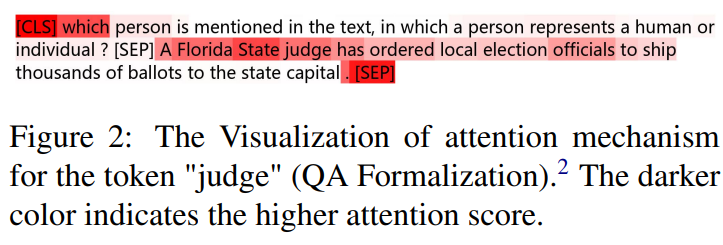

本文提供了一种新的融合标签知识的范式。首先，联合编码效率底下，我们分解问题和问题。其次为了充分利用标签知识，设计了融合模块来显式集成标签和文本表示。

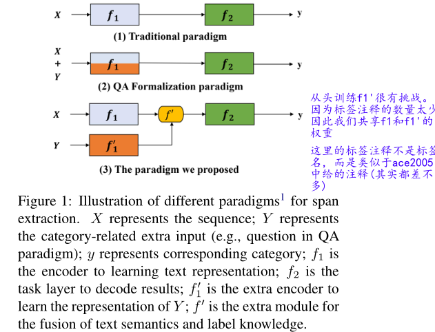

**模型**

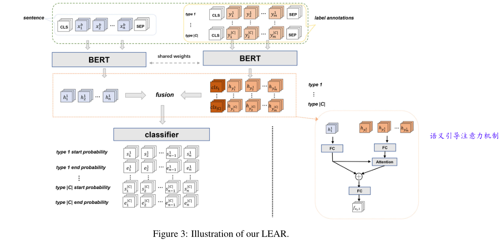

详情见论文。
